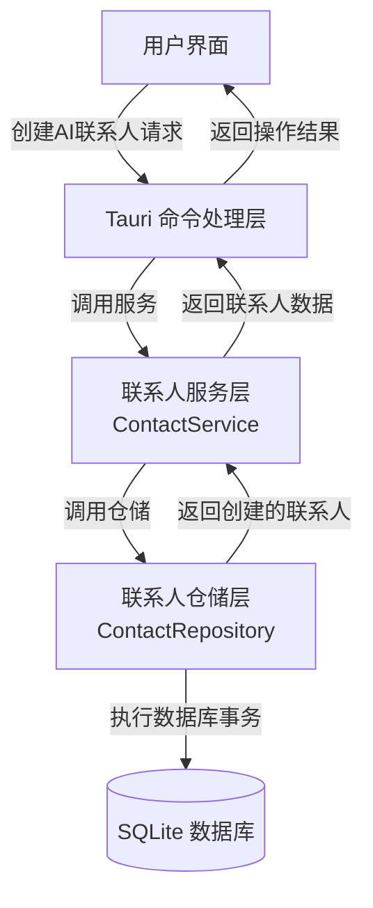
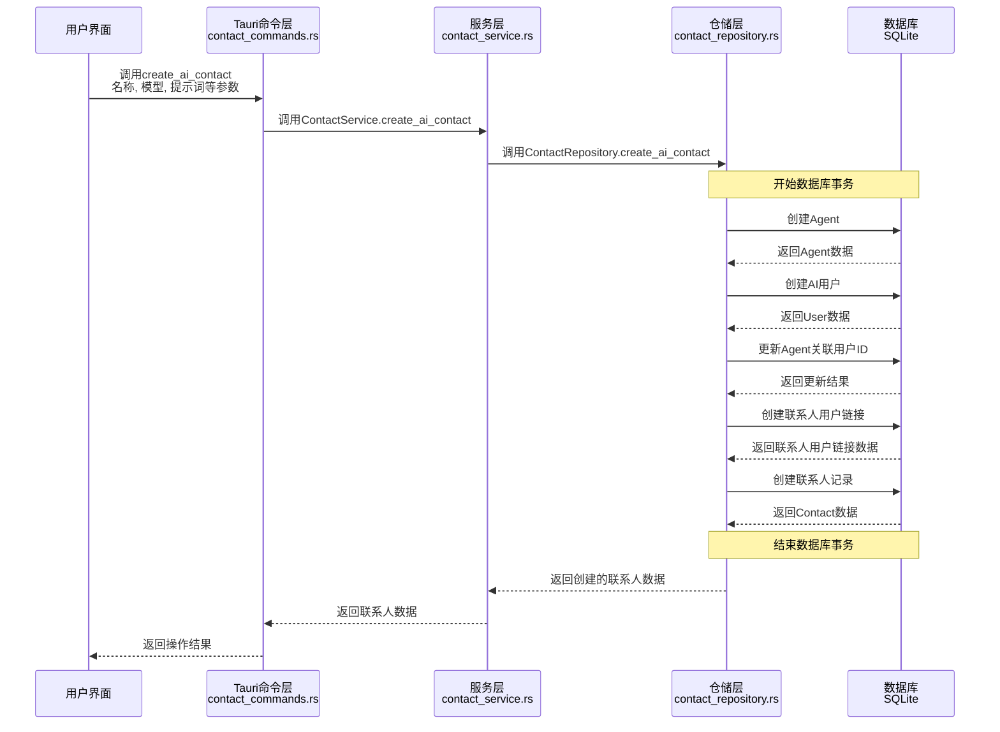
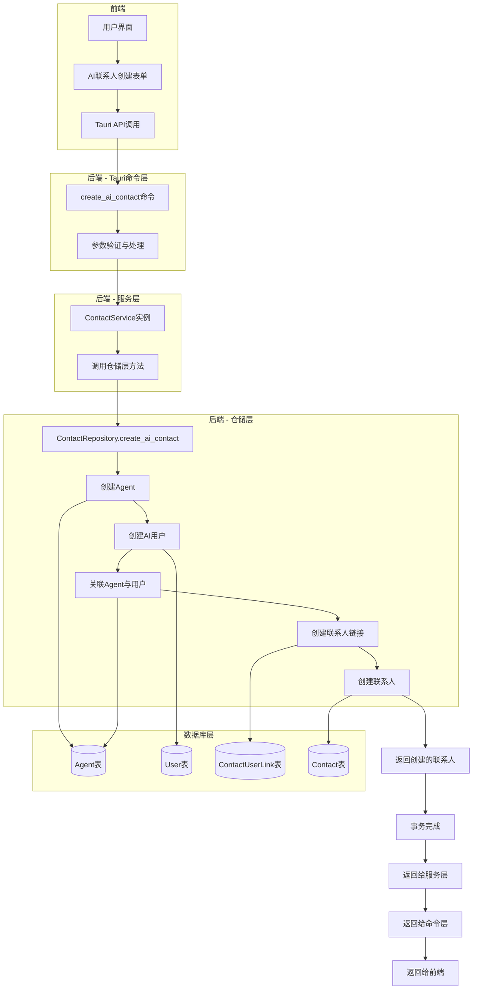
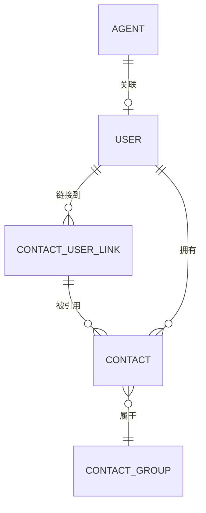

# 通过Agent创建AI联系人的流程图

本文档描述了通过Agent创建AI联系人的完整流程，从前端到后端的数据流向和处理步骤。

## 整体流程



## 详细流程



## 数据流图



## 数据模型关系



## 功能说明

1. 创建AI联系人是一个原子操作，包含多个步骤：

   - 创建Agent（包含AI模型配置）
   - 创建AI用户（is_ai=true）
   - 将Agent关联到AI用户
   - 创建联系人用户链接
   - 创建联系人记录指向AI用户

2. 所有操作在一个数据库事务中完成，确保数据一致性：

   - 如果任何步骤失败，整个操作将回滚
   - 只有全部步骤成功，操作才会提交

3. Agent模型保存了AI的关键配置参数：
   - 模型名称（例如GPT-3.5）
   - 系统提示词
   - 温度参数控制回复的随机性
   - 最大token数限制
   - Top P采样参数等

## 实现设计说明

此实现遵循分层架构设计原则：

1. **命令层 (commands)**：

   - 处理来自前端的请求
   - 验证参数并调用服务层方法

2. **服务层 (services)**：

   - `ContactService`提供业务逻辑
   - 调用仓储层执行具体操作

3. **仓储层 (repositories)**：
   - `ContactRepository`包含与数据库交互的代码
   - 实现事务处理，确保数据一致性

在这个设计中，AI联系人创建逻辑被放置在联系人仓储层，因为它主要是对联系人资源的操作。虽然此操作涉及多种资源（Agent、User、ContactUserLink和Contact），但最终目标是创建联系人，所以从业务角度看，将此功能集成到联系人相关组件中是合理的。

## 前端调用示例

前端创建AI联系人示例代码：

```typescript
// 创建AI联系人请求
const contactRequest: CreateAIContactRequest = {
  name: 'AI助手',
  model_name: 'gpt-3.5-turbo',
  system_prompt: '你是一个AI助手，可以回答各种问题。',
  temperature: 0.7,
  max_tokens: 2000,
  top_p: 0.9,
  avatar_url: 'https://example.com/avatar.png',
  description: '我的AI助手',
  is_streaming: true,
  group_id: 'group-123',
  owner_user_id: currentUserId,
};

// 调用服务创建AI联系人
const newContact = await contactService.createAIContact(contactRequest);
```

## 后端处理流程

### 1. 命令层处理 (contact_commands.rs)

```rust
// 创建AI联系人（原子操作）
#[command]
pub fn create_ai_contact(
    state: State<AppState>,
    request: CreateAIContactRequest,
) -> Result<Contact, String> {
    let pool = state.db_pool.lock().unwrap();
    let service = ContactService::new(pool.clone());

    service.create_ai_contact(
        request.name,
        request.model_name,
        request.system_prompt,
        request.temperature,
        request.max_tokens,
        request.top_p,
        request.avatar_url,
        request.description.clone(),
        request.is_streaming,
        request.description,
        request.group_id,
        request.owner_user_id
    ).map_err(|e| format!("创建AI联系人失败: {}", e))
}
```

### 2. 服务层处理 (contact_service.rs)

```rust
// 创建AI联系人（原子操作）
pub fn create_ai_contact(
    &self,
    // Agent参数
    agent_name: String,
    model_name: String,
    system_prompt: String,
    temperature: f32,
    max_tokens: Option<i32>,
    top_p: Option<f32>,
    avatar_url: Option<String>,
    agent_description: Option<String>,
    is_streaming: bool,

    // 联系人参数
    contact_description: Option<String>,
    group_id: String,
    owner_user_id: String,
) -> RepositoryResult<Contact> {
    self.repository.create_ai_contact(
        agent_name,
        model_name,
        system_prompt,
        temperature,
        max_tokens,
        top_p,
        avatar_url,
        agent_description,
        is_streaming,
        contact_description,
        group_id,
        owner_user_id
    )
}
```

### 3. 仓储层处理 (contact_repository.rs)

```rust
// 创建AI联系人（原子操作）
pub fn create_ai_contact(
    &self,
    // Agent参数
    agent_name: String,
    model_name: String,
    system_prompt: String,
    temperature: f32,
    max_tokens: Option<i32>,
    top_p: Option<f32>,
    avatar_url: Option<String>,
    agent_description: Option<String>,
    is_streaming: bool,

    // 联系人参数
    contact_description: Option<String>,
    group_id: String,
    owner_user_id: String,
) -> RepositoryResult<Contact> {
    // 获取数据库连接
    let mut conn = self.pool.get().map_err(RepositoryError::PoolError)?;

    // 开始事务
    conn.transaction(|conn| {
        // 事务操作，创建Agent、User、链接和联系人
        // ...

        // 返回创建的联系人
        Ok(contact)
    })
}
```

## 注意事项

1. 创建AI联系人是耗时操作，前端应显示加载状态
2. 事务操作确保数据一致性，避免出现不完整记录
3. 每个AI联系人都有独立的配置参数，可根据需要调整
4. 用户需要有权限创建联系人
5. AI用户和普通用户共用User表，通过is_ai字段区分

## 错误处理

可能的错误情况及处理方式：

1. 参数验证失败 - 前端应进行基本验证
2. 数据库连接失败 - 返回连接错误
3. 事务执行失败 - 整个操作回滚，返回具体错误
4. 联系人分组不存在 - 验证分组ID的存在性
5. 用户无权限 - 验证用户权限
