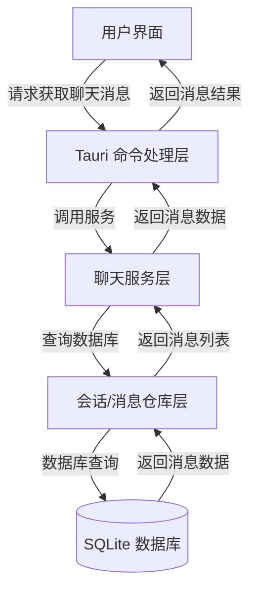
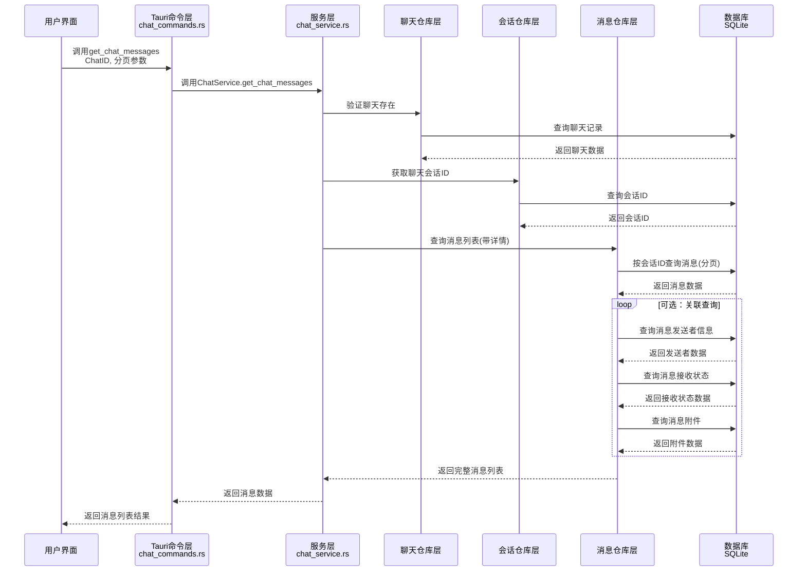
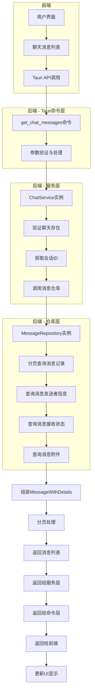
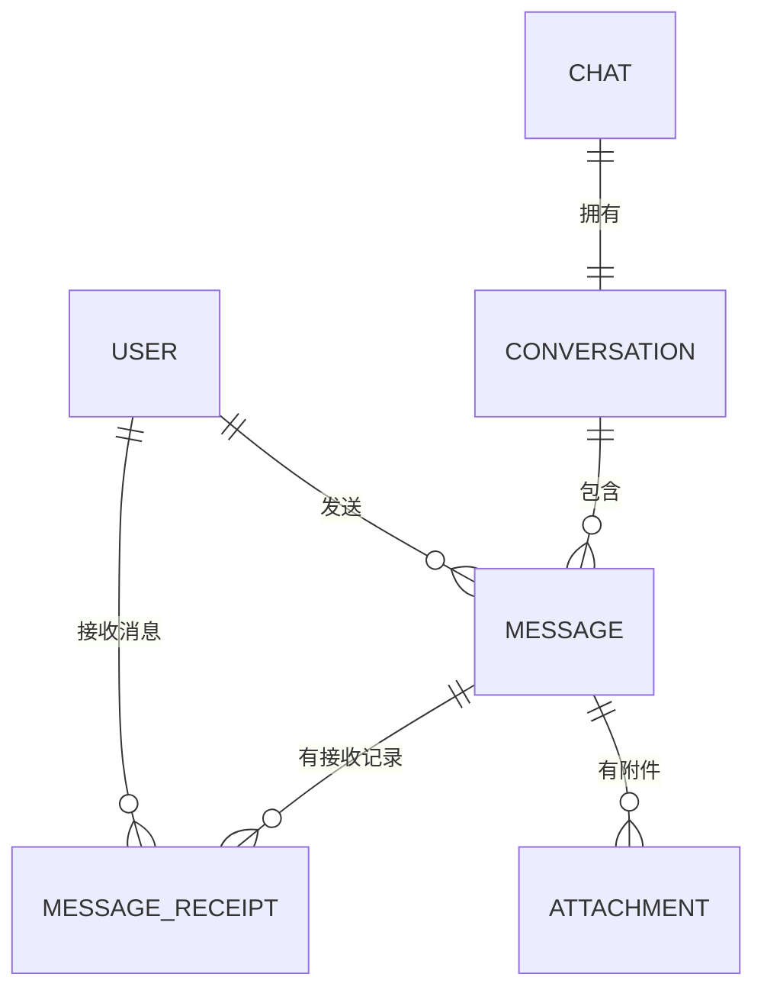

# 获取聊天消息流程

本文档描述了获取特定聊天的消息记录的完整流程，从前端到后端的数据流向和处理步骤。

## 整体流程



## 详细流程



## 数据流图



## 数据模型关系



## 注意事项

1. 消息查询支持分页，避免一次加载过多数据
2. 返回的消息包含发送者信息、接收状态和附件信息
3. 消息默认按时间倒序排序，从新到旧
4. 前端可以通过指定页码和每页消息数进行灵活加载
5. 消息查询经过多层验证，确保数据安全和一致性

## 关键代码解析

### 1. 前端调用

用户在前端调用Tauri命令获取聊天消息：

```javascript
// 前端示例代码
await invoke('get_chat_messages', {
  chatId: 'chat-123',
  page: 1,
  pageSize: 20,
}).then(messages => {
  // 处理返回的消息列表
  console.log(messages);
});
```

### 2. Tauri命令处理 (chat_commands.rs)

```rust
#[command]
pub fn get_chat_messages(
    state: State<AppState>,
    request: GetChatMessagesRequest,
) -> Result<Vec<MessageWithDetails>, String> {
    let pool = state.db_pool.lock().unwrap();
    let service = ChatService::new(pool.clone());

    let page = request.page.unwrap_or(1);
    let page_size = request.page_size.unwrap_or(20);

    service.get_chat_messages(&request.chat_id, page, page_size)
        .map_err(|e| format!("获取聊天消息失败: {}", e))
}
```

### 3. 服务层处理 (chat_service.rs)

```rust
pub fn get_chat_messages(
    &self,
    chat_id: &str,
    page: u32,
    page_size: u32,
) -> RepositoryResult<Vec<MessageWithDetails>> {
    // 1. 检查聊天是否存在
    self.chat_repository.find_by_id(chat_id)?;

    // 2. 获取聊天的会话ID
    let conversation = self.conversation_repository.find_one_by_chat_id(chat_id)?;

    // 3. 获取会话的消息
    self.message_repository.find_by_conversation_with_details(
        &conversation.id,
        page,
        page_size
    )
}
```

### 4. 仓库层处理 (message_repository.rs)

```rust
pub fn find_by_conversation_with_details(
    &self,
    conversation_id: &str,
    page: u32,
    page_size: u32
) -> RepositoryResult<Vec<MessageWithDetails>> {
    let messages = self.find_by_conversation_id_paginated(conversation_id, page, page_size)?;

    // 将Message转换为MessageWithDetails
    let messages_with_details = messages.into_iter()
        .map(|msg| MessageWithDetails {
            id: msg.id,
            content: msg.content,
            content_type: msg.content_type,
            status: msg.status,
            created_at: msg.created_at,
            updated_at: msg.updated_at,
            conversation_id: msg.conversation_id.clone(),
            sender_id: msg.sender_id.clone(),
            sender_name: None, // 需要关联查询用户表获取
            receipts: vec![], // 需要关联查询消息接收表获取
            attachments: vec![], // 需要关联查询附件表获取
        })
        .collect();

    Ok(messages_with_details)
}
```

## 完整处理流程

1. 用户请求获取特定聊天的消息记录
2. Tauri命令层接收请求，验证并解析参数
3. 聊天服务层验证聊天存在性，获取对应会话ID
4. 消息仓库层执行分页查询，获取基本消息数据
5. 可选：关联查询发送者信息、接收状态和附件
6. 组装完整的消息数据，包含所有详细信息
7. 返回分页后的消息列表给前端
8. 前端更新UI，展示聊天消息

## 优化建议

1. 可以实现消息缓存机制，减少重复查询
2. 考虑使用WebSocket实现实时消息推送
3. 前端可实现虚拟滚动，提高大量消息的显示性能
4. 对于图片和文件类消息，可实现懒加载和缩略图预览
5. 添加消息搜索功能，方便用户查找历史消息
