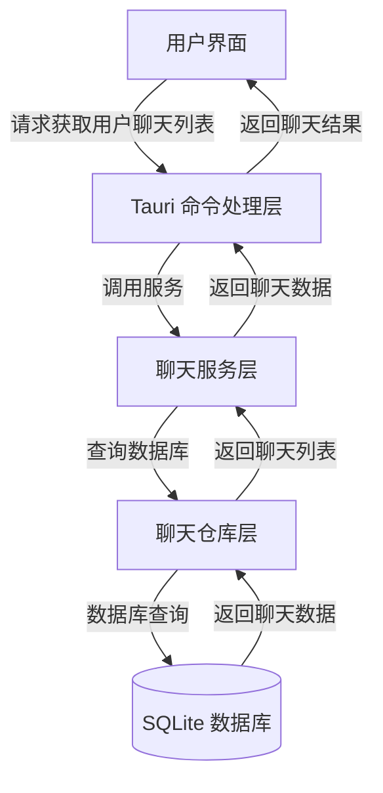
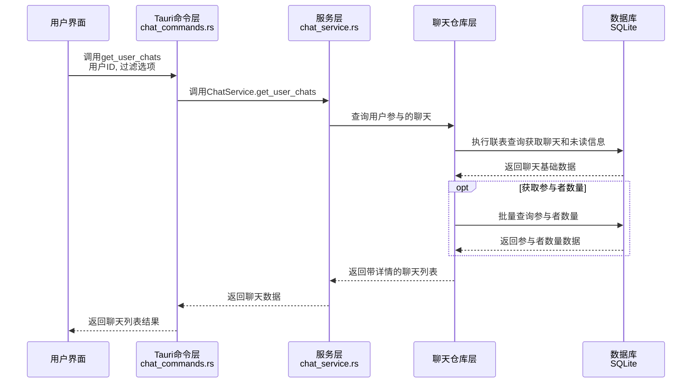
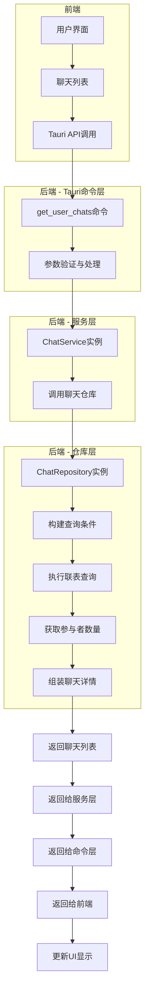
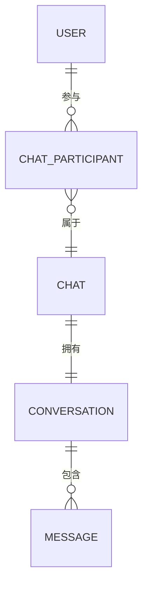

# 获取用户聊天列表流程

本文档描述了获取特定用户的聊天列表的完整流程，从前端到后端的数据流向和处理步骤，充分利用Chat表中缓存的最后消息信息。

## 整体流程



## 详细流程



## 数据流图



## 数据模型关系



## 优化要点

1. **充分利用Chat表结构**：Chat表已缓存最后一条消息的内容、时间、发送者等信息，无需额外查询Message表
2. **高效联表查询**：仅联表ChatParticipant获取未读数量和最后读取消息ID
3. **灵活排序选项**：支持多种排序方式（最后消息时间、创建时间、标题等）
4. **参与者数量批量查询**：一次性查询所有聊天的参与者数量，避免N+1查询问题
5. **过滤空聊天**：可选择是否包含没有消息的聊天

## 关键代码解析

### 1. 前端调用

用户在前端调用Tauri命令获取聊天列表：

```javascript
// 前端示例代码
await invoke('get_user_chats', {
  userId: 'user-123',
  includeEmpty: false,
  sortBy: 'last_message_time',
}).then(chats => {
  // 处理返回的聊天列表
  console.log(chats);
});
```

### 2. Tauri命令处理 (chat_commands.rs)

```rust
#[command]
pub fn get_user_chats(
    state: State<AppState>,
    request: GetUserChatsRequest,
) -> Result<Vec<ChatWithDetails>, String> {
    let pool = state.db_pool.lock().unwrap();
    let service = ChatService::new(pool.clone());

    let include_empty = request.include_empty.unwrap_or(false);
    let sort_by = request.sort_by.unwrap_or("last_message_time".to_string());

    service.get_user_chats(&request.user_id, include_empty, &sort_by)
        .map_err(|e| format!("获取用户聊天列表失败: {}", e))
}
```

### 3. 服务层处理 (chat_service.rs)

```rust
pub fn get_user_chats(
    &self,
    user_id: &str,
    include_empty: bool,
    sort_by: &str,
) -> RepositoryResult<Vec<ChatWithDetails>> {
    self.chat_repository.find_user_chats(user_id, include_empty, sort_by)
}
```

### 4. 仓库层处理 (chat_repository.rs)

```rust
pub fn find_user_chats(
    &self,
    user_id: &str,
    include_empty: bool,
    sort_by: &str,
) -> RepositoryResult<Vec<ChatWithDetails>> {
    let mut conn = self.pool.get().map_err(RepositoryError::PoolError)?;

    // 构建基本查询
    let mut query = chats::table
        .inner_join(chat_participants::table)
        .filter(chat_participants::user_id.eq(user_id))
        .into_boxed();

    // 如果不包含空聊天，添加过滤条件
    if !include_empty {
        query = query.filter(chats::last_message_id.is_not_null());
    }

    // 根据排序字段添加排序
    match sort_by {
        "created_at" => {
            query = query.order_by(chats::created_at.desc());
        },
        "title" => {
            query = query.order_by(chats::title.asc());
        },
        // 其他排序选项...
        _ => {
            // 默认按最后消息时间排序
            query = query.order_by(chats::last_message_time.desc().nulls_last());
        }
    }

    // 执行查询并处理结果...
}
```

## 完整处理流程

1. 用户请求获取个人聊天列表，可指定排序和过滤选项
2. Tauri命令层接收请求，验证并解析参数
3. 聊天服务层调用仓库层的查询方法
4. 聊天仓库层构建优化的查询条件，执行联表查询
5. 获取参与者数量等额外信息
6. 组装完整的聊天数据，充分利用Chat表中缓存的最后消息信息
7. 返回聊天列表给前端
8. 前端更新UI，展示用户的聊天列表

## 性能优势

1. **减少查询次数**：利用Chat表中缓存的最后消息信息，避免额外查询Message表
2. **批量处理**：一次性获取多个聊天的参与者数量，减少数据库访问次数
3. **灵活过滤**：支持过滤无消息的聊天，减少不必要的数据传输
4. **高效排序**：在数据库层面完成排序，减轻应用层负担
5. **可扩展设计**：支持添加更多排序和过滤选项，满足业务需求变化

## 注意事项

1. 返回的聊天列表包含未读消息数量、最后一条消息内容、发送者信息等详细数据
2. 聊天默认按最后消息时间排序，从新到旧
3. 用户必须是聊天的参与者才能获取聊天列表
4. 聊天信息中包括参与者数量、最后活跃时间等
5. 支持获取不同类型的聊天（个人、群组）

## 关键代码解析

### 1. 前端调用

用户在前端调用Tauri命令获取聊天列表：

```javascript
// 前端示例代码
await invoke('get_user_chats', {
  userId: 'user-123',
  includeEmpty: false,
  sortBy: 'last_message_time',
}).then(chats => {
  // 处理返回的聊天列表
  console.log(chats);
});
```

### 2. Tauri命令处理 (chat_commands.rs)

```rust
#[command]
pub fn get_user_chats(
    state: State<AppState>,
    request: GetUserChatsRequest,
) -> Result<Vec<ChatWithDetails>, String> {
    let pool = state.db_pool.lock().unwrap();
    let service = ChatService::new(pool.clone());

    let include_empty = request.include_empty.unwrap_or(false);
    let sort_by = request.sort_by.unwrap_or("last_message_time".to_string());

    service.get_user_chats(&request.user_id, include_empty, &sort_by)
        .map_err(|e| format!("获取用户聊天列表失败: {}", e))
}
```

### 3. 服务层处理 (chat_service.rs)

```rust
pub fn get_user_chats(
    &self,
    user_id: &str,
    include_empty: bool,
    sort_by: &str,
) -> RepositoryResult<Vec<ChatWithDetails>> {
    self.chat_repository.find_user_chats(user_id, include_empty, sort_by)
}
```

### 4. 仓库层处理 (chat_repository.rs)

```rust
pub fn find_user_chats(
    &self,
    user_id: &str,
    include_empty: bool,
    sort_by: &str,
) -> RepositoryResult<Vec<ChatWithDetails>> {
    let mut conn = self.pool.get().map_err(RepositoryError::PoolError)?;

    // 构建基本查询
    let mut query = chats::table
        .inner_join(chat_participants::table)
        .filter(chat_participants::user_id.eq(user_id))
        .into_boxed();

    // 如果不包含空聊天，添加过滤条件
    if !include_empty {
        query = query.filter(chats::last_message_id.is_not_null());
    }

    // 根据排序字段添加排序
    match sort_by {
        "created_at" => {
            query = query.order_by(chats::created_at.desc());
        },
        "title" => {
            query = query.order_by(chats::title.asc());
        },
        // 其他排序选项...
        _ => {
            // 默认按最后消息时间排序
            query = query.order_by(chats::last_message_time.desc().nulls_last());
        }
    }

    // 执行查询并处理结果...
}
```

## 完整处理流程

1. 用户请求获取个人聊天列表，可指定排序和过滤选项
2. Tauri命令层接收请求，验证并解析参数
3. 聊天服务层调用仓库层的查询方法
4. 聊天仓库层构建优化的查询条件，执行联表查询
5. 获取参与者数量等额外信息
6. 组装完整的聊天数据，充分利用Chat表中缓存的最后消息信息
7. 返回聊天列表给前端
8. 前端更新UI，展示用户的聊天列表

## 优化建议

1. 可以实现聊天列表缓存机制，减少重复查询
2. 考虑使用WebSocket实现聊天列表实时更新
3. 前端可实现虚拟滚动，提高大量聊天的显示性能
4. 添加聊天分类和搜索功能，方便用户快速找到特定聊天
5. 支持聊天置顶和归档功能，提升用户体验
