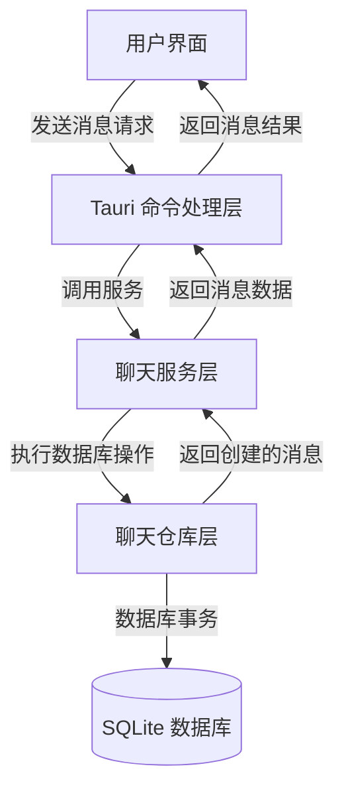
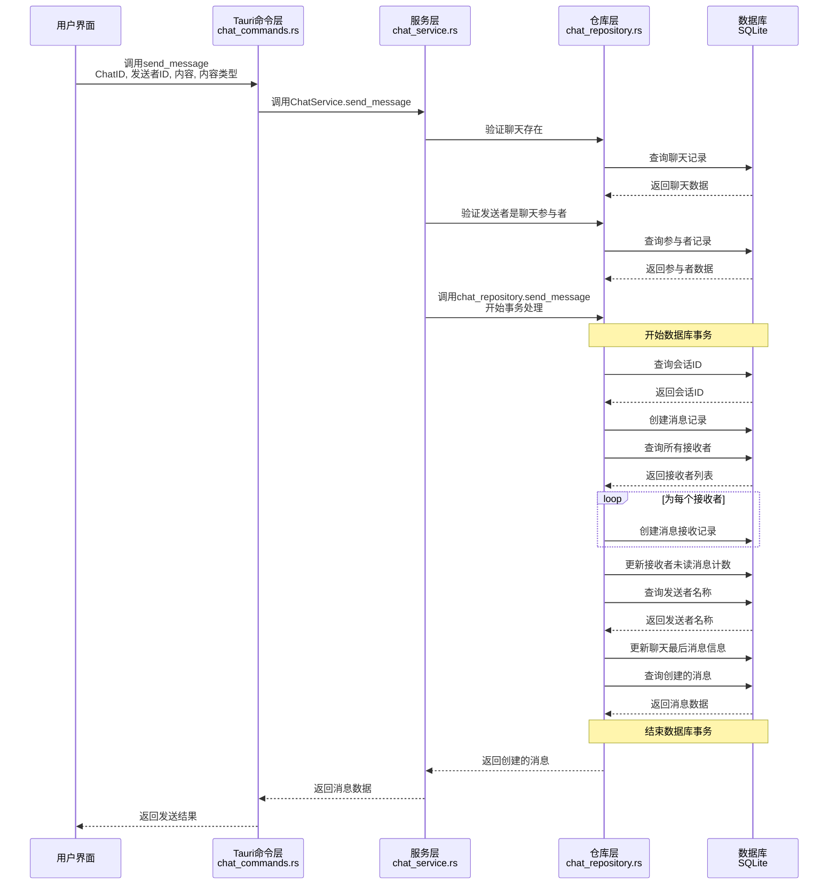
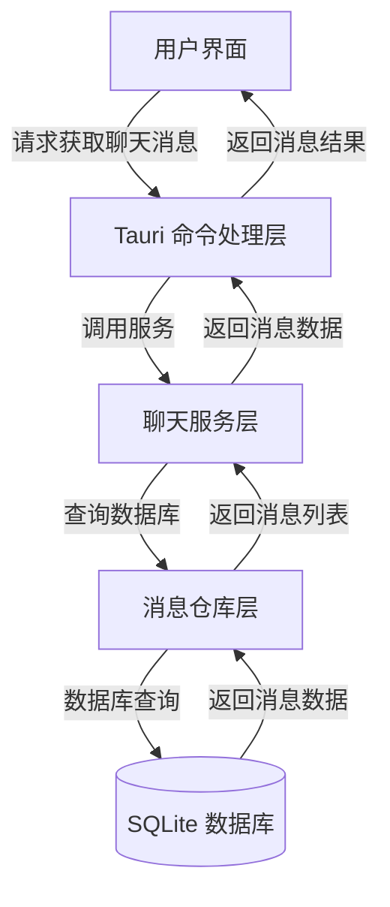
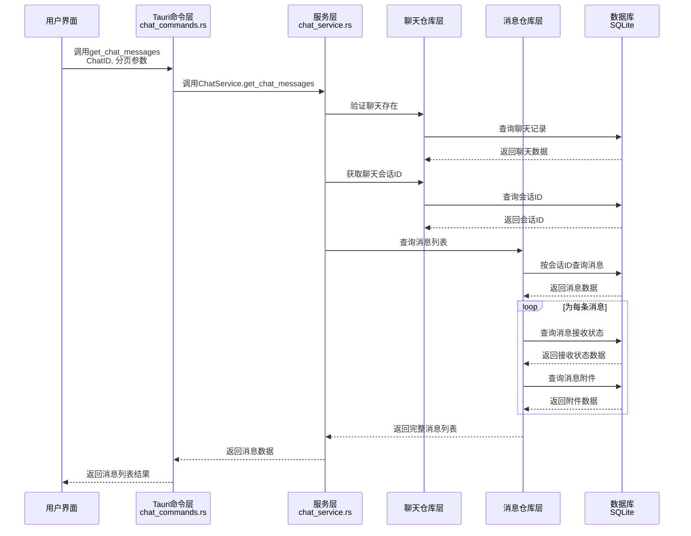
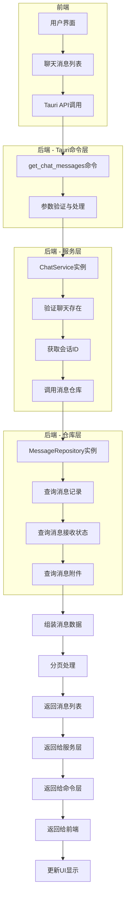
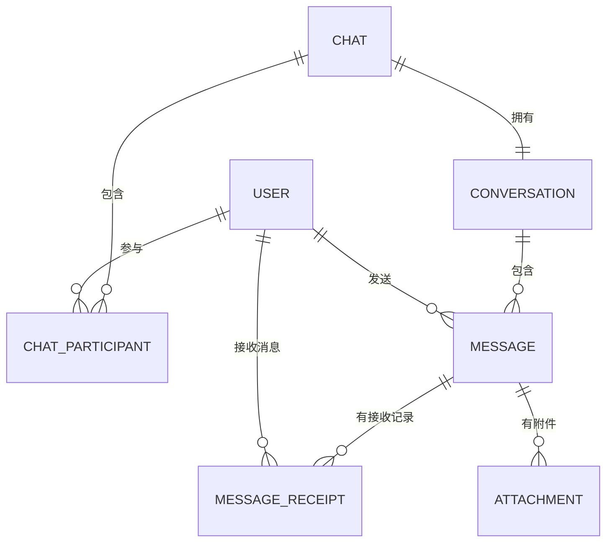

# 用户发送消息到聊天的流程图

本文档描述了用户发送消息给聊天的完整流程，从前端到后端的数据流向和处理步骤。

## 整体流程



## 详细流程



# 获取指定聊天的消息记录流程图

本部分描述了获取指定聊天的消息记录的完整流程，从前端到后端的数据流向和处理步骤。

## 整体流程



## 详细流程



## 数据流图



## 数据模型关系



## 注意事项

1. 消息查询应支持分页，避免一次加载过多数据
2. 返回消息时应包含发送者信息、接收状态和附件信息
3. 消息应按时间顺序排序，通常最新的消息在最下方
4. 前端应处理不同类型的消息显示（文本、图片、文件等）
5. 可以考虑实现消息加载时的滚动加载机制，提高用户体验

## 关键代码解析

### 1. 前端调用

用户在前端调用Tauri命令发送消息：

```javascript
// 前端示例代码
await invoke('send_message', {
  chatId: 'chat-123',
  senderId: 'user-456',
  content: '你好！',
  contentType: 'text',
});
```

### 2. Tauri命令处理 (chat_commands.rs)

```rust
#[command]
pub fn send_message(
    state: State<AppState>,
    request: SendMessageRequest,
) -> Result<Message, String> {
    let pool = state.db_pool.lock().unwrap();
    let service = ChatService::new(pool.clone());

    service.send_message(
        &request.chat_id,
        &request.sender_id,
        request.content,
        request.content_type,
    )
    .map_err(|e| format!("发送消息失败: {}", e))
}
```

### 3. 服务层处理 (chat_service.rs)

```rust
pub fn send_message(
    &self,
    chat_id: &str,
    sender_id: &str,
    content: String,
    content_type: String,
) -> RepositoryResult<Message> {
    // 1. 检查聊天是否存在
    self.chat_repository.find_by_id(chat_id)?;

    // 2. 检查发送者是否是聊天参与者
    self.participant_repository.find_by_chat_and_user(chat_id, sender_id)?;

    // 3. 发送消息
    self.chat_repository.send_message(chat_id, sender_id, content, content_type)
}
```

### 4. 仓库层处理 (chat_repository.rs)

```rust
pub fn send_message(
    &self,
    chat_id: &str,
    sender_id: &str,
    content: String,
    content_type: String,
) -> RepositoryResult<Message> {
    let mut conn = self.pool.get().map_err(RepositoryError::PoolError)?;

    conn.transaction(|conn| {
        // 事务处理，包括创建消息、更新未读计数等多个操作
        // ...
    })
    .map_err(RepositoryError::DatabaseError)
}
```

## 代码实现建议

### 1. Tauri命令层 (chat_commands.rs)

```rust
#[derive(Debug, Deserialize)]
pub struct GetChatMessagesRequest {
    chat_id: String,
    page: Option<u32>,
    page_size: Option<u32>,
}

/// 获取指定聊天的消息记录
///
/// # 参数
/// * `request` - 包含聊天ID和分页参数的请求
///
/// # 返回
/// * `Result<Vec<MessageWithDetails>, String>` - 成功返回消息列表，失败返回错误信息
#[command]
pub fn get_chat_messages(
    state: State<AppState>,
    request: GetChatMessagesRequest,
) -> Result<Vec<MessageWithDetails>, String> {
    let pool = state.db_pool.lock().unwrap();
    let service = ChatService::new(pool.clone());

    let page = request.page.unwrap_or(1);
    let page_size = request.page_size.unwrap_or(20);

    service.get_chat_messages(&request.chat_id, page, page_size)
        .map_err(|e| format!("获取聊天消息失败: {}", e))
}
```

### 2. 服务层实现 (chat_service.rs)

```rust
/// 获取指定聊天的消息记录
///
/// # 参数
/// * `chat_id` - 聊天ID
/// * `page` - 页码，从1开始
/// * `page_size` - 每页消息数量
///
/// # 返回
/// * `RepositoryResult<Vec<MessageWithDetails>>` - 消息列表及详情
pub fn get_chat_messages(
    &self,
    chat_id: &str,
    page: u32,
    page_size: u32,
) -> RepositoryResult<Vec<MessageWithDetails>> {
    // 1. 检查聊天是否存在
    self.chat_repository.find_by_id(chat_id)?;

    // 2. 获取聊天的会话ID
    let conversation = self.conversation_repository.find_by_chat_id(chat_id)?;

    // 3. 获取会话的消息
    self.message_repository.find_by_conversation_with_details(
        &conversation.id,
        page,
        page_size
    )
}
```

## 注意事项

1. 整个流程在一个数据库事务中完成，确保数据一致性
2. 为每个接收者创建消息接收记录，用于跟踪消息状态
3. 更新接收者的未读消息计数
4. 更新聊天的最后消息信息，便于前端显示聊天列表
5. 返回创建的消息数据给前端，用于更新聊天界面
