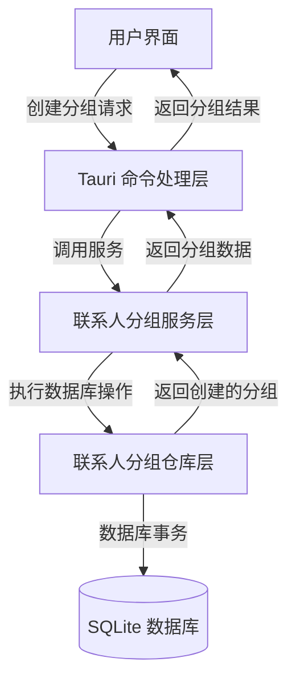
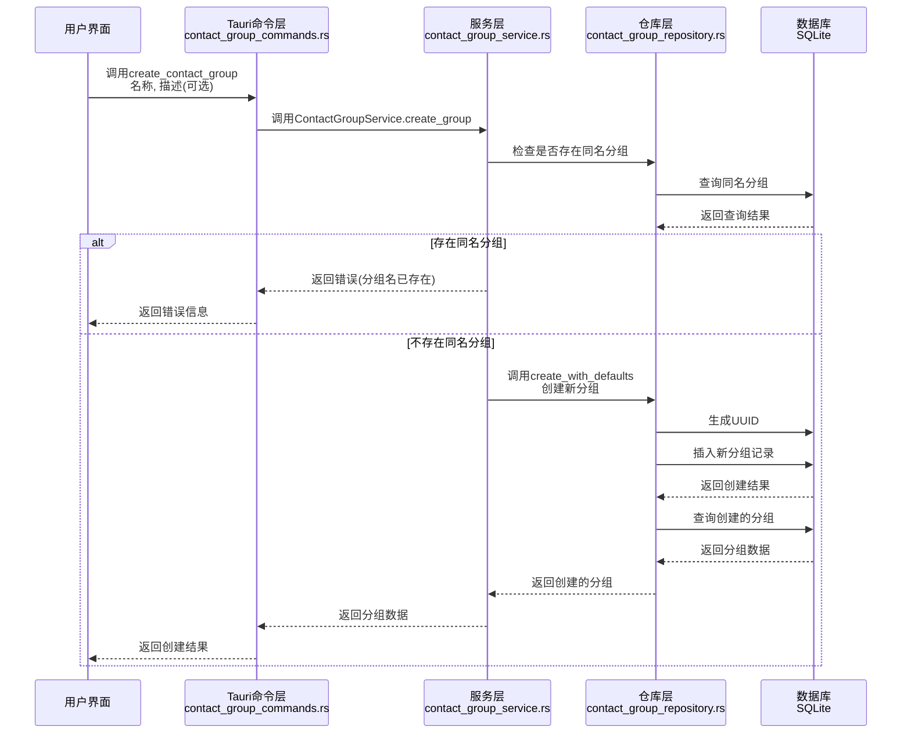
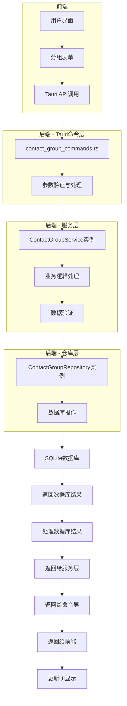

# 创建联系人分组的流程图

本文档描述了创建联系人分组的完整流程，从前端到后端的数据流向和处理步骤。

## 整体流程



## 详细流程



## 数据流图



## 注意事项

1. 创建分组时需要验证分组名称是否已存在，避免重复
2. 分组ID使用UUID自动生成，确保唯一性
3. 分组描述是可选的，可以为null

## 关键代码解析

### 1. 前端调用

用户在前端调用Tauri命令创建分组：

```javascript
// 前端示例代码
await invoke('create_contact_group', {
  request: {
    name: '工作',
    description: '工作相关的联系人',
  },
});
```

### 2. Tauri命令处理 (contact_group_commands.rs)

```rust
#[command]
pub fn create_contact_group(
    state: State<AppState>,
    request: CreateGroupRequest,
) -> Result<ContactGroup, String> {
    let pool = state.db_pool.lock().unwrap();
    let service = ContactGroupService::new(pool.clone());

    service.create_group(request.name, request.description)
        .map_err(|e| format!("创建联系人组失败: {}", e))
}
```

### 3. 服务层处理 (contact_group_service.rs)

```rust
pub fn create_group(&self, name: String, description: Option<String>) -> RepositoryResult<ContactGroup> {
    // 检查是否已存在同名分组
    let existing_groups = self.repository.find_by_name(&name)?;
    if !existing_groups.is_empty() {
        return Err(RepositoryError::AlreadyExists(format!("联系人组名称 '{}' 已存在", name)));
    }

    self.repository.create_with_defaults(name, description)
}
```

### 4. 仓库层处理 (contact_group_repository.rs)

```rust
pub fn create_with_defaults(&self, name: String, description: Option<String>) -> RepositoryResult<ContactGroup> {
    let new_group = NewContactGroup {
        id: uuid::Uuid::new_v4().to_string(),
        name,
        description,
    };

    self.create(new_group)
}

pub fn create(&self, new_group: NewContactGroup) -> RepositoryResult<ContactGroup> {
    let mut conn = self.pool.get().map_err(RepositoryError::PoolError)?;

    diesel::insert_into(contact_groups::table)
        .values(&new_group)
        .execute(&mut conn)
        .map_err(RepositoryError::DatabaseError)?;

    contact_groups::table
        .filter(contact_groups::id.eq(&new_group.id))
        .first(&mut conn)
        .map_err(RepositoryError::DatabaseError)
}
```
