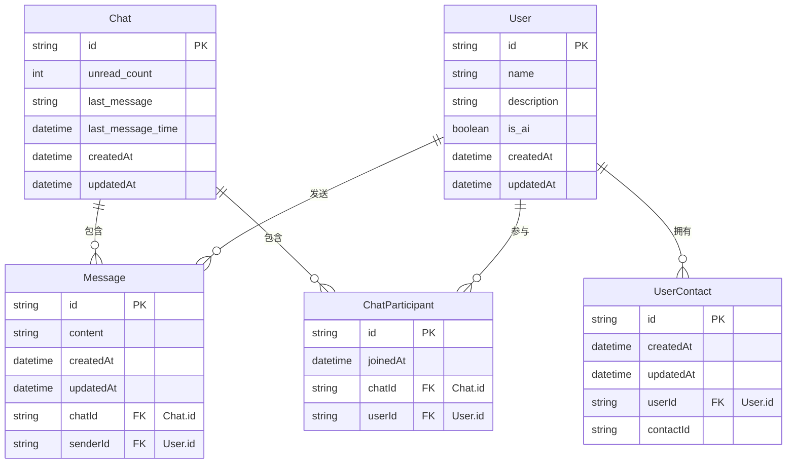
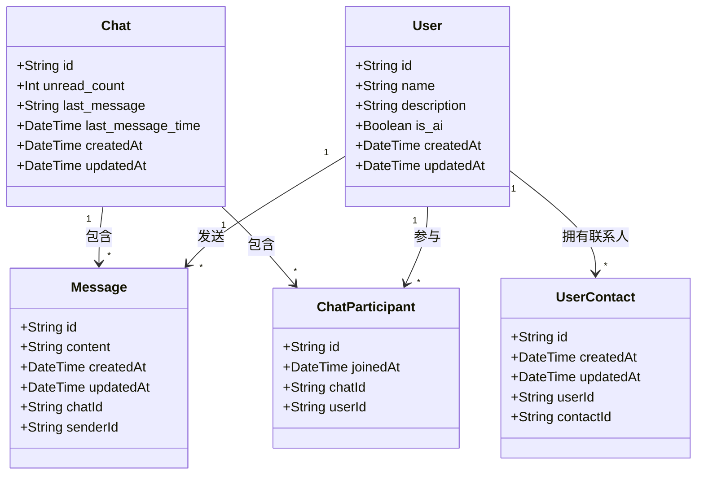

# 数据库关系图

本文档描述了应用程序的数据库结构和表之间的关系。

## 实体关系图 (ERD)

## 基数关系图

下面使用类图表示各实体间的基数关系，更直观地展示一对一、一对多等关系：

## 关系类型说明

在上面的基数关系图中：

- **1对多关系 (1:N)**
  - User 与 Message：一个用户可以发送多条消息
  - User 与 ChatParticipant：一个用户可以参与多个聊天
  - User 与 UserContact：一个用户可以有多个联系人
  - Chat 与 ChatParticipant：一个聊天可以包含多个参与者
  - Chat 与 Message：一个聊天可以包含多条消息

- **多对多关系 (M:N)**
  - User 与 Chat：通过 ChatParticipant 表实现，一个用户可以参与多个聊天，一个聊天可以有多个用户参与

## 表关系说明

### 用户相关

1. **User (用户)**
   - 包含基本用户信息
   - 一个用户可以发送多条消息 (`messages`)
   - 一个用户可以参与多个聊天 (`chats`)
   - 一个用户可以有多个联系人 (`contacts`)

2. **UserContact (用户联系人)**
   - 表示用户与联系人的关系
   - 每个记录代表一个用户添加了另一个用户作为联系人
   - 只存储联系人ID，不存储其他信息

### 聊天相关

3. **Chat (聊天)**
   - 代表一个聊天会话
   - 包含未读消息数量 (`unread_count`)
   - 包含最后一条消息内容 (`last_message`)
   - 包含最后一条消息时间 (`last_message_time`)
   - 包含多个参与者 (`participants`)
   - 包含多条消息 (`messages`)

4. **ChatParticipant (聊天参与者)**
   - 多对多关系表，连接Chat和User
   - 一个用户在一个聊天中只能有一个参与记录

5. **Message (消息)**
   - 包含消息内容
   - 有一个发送者 (`sender`)
   - 属于一个聊天 (`chat`)

## 主要业务流程

### 创建聊天流程

1. 创建一个Chat实例
2. 创建ChatParticipant记录，添加参与者

### 发送消息流程

1. 在指定Chat中创建Message，指定发送者
2. 通过触发器自动更新Chat的最后消息信息

### 添加联系人流程

1. 在UserContact表中创建记录，指定user_id和contact_id

### 获取聊天历史流程

1. 查询指定Chat的所有Message
2. 按时间顺序排列显示
