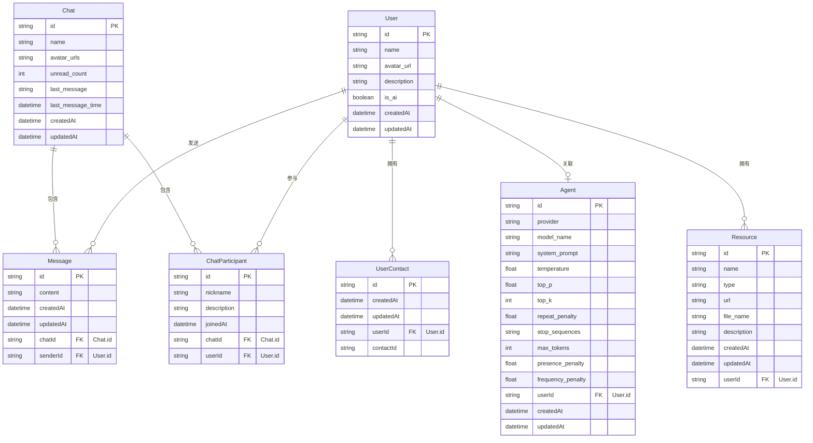

# 数据库关系图

本文档描述了应用程序的数据库结构和表之间的关系。

## 实体关系图 (ERD)

## 基数关系图

下面使用类图表示各实体间的基数关系，更直观地展示一对一、一对多等关系：

## 关系类型说明

在上面的基数关系图中：

- **1对1关系 (1:1)**
  - User 与 Agent：一个用户最多关联一个AI代理

- **1对多关系 (1:N)**
  - User 与 Message：一个用户可以发送多条消息
  - User 与 ChatParticipant：一个用户可以参与多个聊天
  - User 与 UserContact：一个用户可以有多个联系人
  - User 与 Resource：一个用户可以拥有多个资源
  - Chat 与 ChatParticipant：一个聊天可以包含多个参与者
  - Chat 与 Message：一个聊天可以包含多条消息

- **多对多关系 (M:N)**
  - User 与 Chat：通过 ChatParticipant 表实现，一个用户可以参与多个聊天，一个聊天可以有多个用户参与

## 表关系说明

### 用户相关

1. **User (用户)**
   - 包含基本用户信息
   - 一个用户可以发送多条消息 (`messages`)
   - 一个用户可以参与多个聊天 (`chats`)
   - 一个用户可以有多个联系人 (`contacts`)
   - 一个用户可以关联一个AI代理 (`agent`)
   - 一个用户可以拥有多个资源 (`resources`)

2. **Agent (AI代理)**
   - 包含模型提供商和模型名称信息
   - 包含系统提示词以控制AI的行为
   - 包含多种推理参数用于微调模型输出:
     - temperature、top_p、top_k等控制随机性和多样性
     - repeat_penalty控制重复内容
     - max_tokens控制生成长度
     - 其他参数微调生成质量
   - 与用户是一对一关系

3. **UserContact (用户联系人)**
   - 表示用户与联系人的关系
   - 每个记录代表一个用户添加了另一个用户作为联系人
   - 只存储联系人ID，不存储其他信息

4. **Resource (资源)**
   - 表示用户拥有的各种资源
   - 包含资源的基本信息，如名称、类型、URL等
   - 类型字段区分不同类型的资源(文本、图片等)
   - 每个资源都关联到一个用户，表示资源的所有者
   - 文件名和URL用于定位和访问资源

### 聊天相关

5. **Chat (聊天)**
   - 代表一个聊天会话
   - 包含聊天名称 (`name`)
   - 包含头像URL数组 (`avatar_urls`)，以逗号分隔存储
   - 包含未读消息数量 (`unread_count`)
   - 包含最后一条消息内容 (`last_message`)
   - 包含最后一条消息时间 (`last_message_time`)
   - 包含多个参与者 (`participants`)
   - 包含多条消息 (`messages`)

6. **ChatParticipant (聊天参与者)**
   - 多对多关系表，连接Chat和User
   - 包含用户在特定聊天中的昵称 (`nickname`)
   - 包含用户在特定聊天中的描述 (`description`)
   - 允许用户在不同聊天中使用不同的身份标识
   - 一个用户在一个聊天中只能有一个参与记录

7. **Message (消息)**
   - 包含消息内容
   - 有一个发送者 (`sender`)
   - 属于一个聊天 (`chat`)

## 主要业务流程

### 创建聊天流程

1. 创建一个Chat实例
2. 创建ChatParticipant记录，添加参与者

### 发送消息流程

1. 在指定Chat中创建Message，指定发送者
2. 通过触发器自动更新Chat的最后消息信息

### 添加联系人流程

1. 在UserContact表中创建记录，指定user_id和contact_id

### 关联AI代理流程

1. 创建Agent记录，指定provider、model_name和各种模型参数
2. 关联到特定用户

### 调整AI行为流程

1. 更新Agent记录中的system_prompt和其他参数
2. 修改temperature等参数调整输出随机性与创造性

### 设置聊天昵称和描述流程

1. 更新用户在特定聊天中的ChatParticipant记录
2. 设置nickname和description字段

### 获取聊天历史流程

1. 查询指定Chat的所有Message
2. 按时间顺序排列显示

### 管理资源流程

1. 创建Resource记录，指定用户ID、资源类型和基本信息
2. 上传图片或文本内容到资源存储位置
3. 更新Resource的URL字段指向实际存储位置
