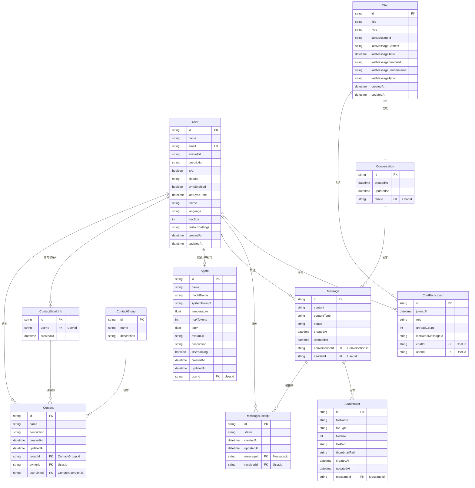

# 数据库关系图

本文档描述了应用程序的数据库结构和表之间的关系。

## 实体关系图 (ERD)

## 基数关系图

下面使用类图表示各实体间的基数关系，更直观地展示一对一、一对多等关系：

## 关系类型说明

在上面的基数关系图中：

- **1对1关系 (1:1)**

  - User 与 Agent：一个AI用户关联一个Agent配置
  - Chat 与 Conversation：一个聊天关联一个会话

- **1对多关系 (1:N)**

  - User 与 Contact：一个用户可以拥有多个联系人
  - User 与 ContactUserLink：一个用户可以作为多个联系人的对象
  - ContactUserLink 与 Contact：一个联系人链接可以关联多个联系人
  - ContactGroup 与 Contact：一个分组可以包含多个联系人
  - User 与 Message：一个用户可以发送多条消息
  - User 与 MessageReceipt：一个用户可以接收多条消息
  - Message 与 MessageReceipt：一条消息可以被多个用户接收
  - User 与 ChatParticipant：一个用户可以参与多个聊天
  - Chat 与 ChatParticipant：一个聊天可以包含多个参与者
  - Conversation 与 Message：一个会话可以包含多条消息
  - Message 与 Attachment：一条消息可以包含多个附件

- **多对多关系 (M:N)**
  - User 与 Chat：通过 ChatParticipant 表实现，一个用户可以参与多个聊天，一个聊天可以有多个用户参与
  - User 与 Message(接收)：通过 MessageReceipt 表实现，一个用户可以接收多条消息，一条消息可以被多个用户接收

## 表关系说明

### 用户相关

1. **User (用户)**

   - 可以是真实用户或AI用户
   - 一个用户可以拥有多个联系人 (`ownedContacts`)
   - 一个用户可以作为多个联系人的对象 (`contactLinks`)
   - 如果是AI用户，可以关联一个Agent配置 (`agentConfig`)
   - 一个用户可以发送多条消息 (`sentMessages`)
   - 一个用户可以接收多条消息 (`messageReceipts`)
   - 一个用户可以参与多个聊天 (`participatedChats`)

2. **Agent (AI代理)**
   - 包含AI模型的配置信息
   - 与一个AI用户关联 (`user`)，一对一关系

### 联系人相关

3. **ContactGroup (联系人分组)**

   - 一个分组可以包含多个联系人 (`contacts`)

4. **Contact (联系人)**

   - 属于一个用户 (`owner`)
   - 通过 ContactUserLink 链接到一个用户 (`userLink`)
   - 属于一个联系人分组 (`group`)

5. **ContactUserLink (联系人用户链接)**
   - 中间表，处理联系人与用户的关系
   - 链接到一个用户 (`user`)
   - 可以被多个联系人引用 (`contacts`)

### 聊天相关

6. **Chat (聊天)**

   - 代表一个聊天会话
   - 包含多个参与者 (`participants`)
   - 关联一个会话 (`conversation`)，一对一关系
   - 存储最后一条消息的信息 (`lastMessageId`, `lastMessageContent`, `lastMessageTime`, `lastMessageSenderName`, `lastMessageType`)

7. **ChatParticipant (聊天参与者)**

   - 多对多关系表，连接Chat和User
   - 一个用户在一个聊天中只能有一个参与记录
   - 存储用户在聊天中的未读消息数量 (`unreadCount`)
   - 存储用户在聊天中最后读取的消息ID (`lastReadMessageId`)

8. **Conversation (会话)**

   - 包含消息历史
   - 关联一个聊天 (`chat`)，一对一关系
   - 包含多条消息 (`messages`)

9. **Message (消息)**

   - 属于一个会话 (`conversation`)
   - 有一个发送者 (`sender`)
   - 可以被多个用户接收 (`receipts`)
   - 可以包含多个附件 (`attachments`)

10. **MessageReceipt (消息接收记录)**

    - 中间表，处理消息与接收者的关系
    - 链接到一条消息 (`message`)
    - 链接到一个接收者 (`receiver`)
    - 记录消息的接收状态

11. **Attachment (附件)**
    - 属于一条消息 (`message`)

## 主要业务流程

### 创建联系人流程

1. 创建一个Agent实例
2. 创建一个AI类型的User，并关联到这个Agent
3. 创建一个ContactUserLink，关联到这个User
4. 创建一个ContactGroup（如果需要新分组）
5. 创建一个Contact，关联到：
   - 拥有者用户（通过`ownerId`字段）
   - 联系人用户链接（通过`userLinkId`字段）
   - 联系人分组（通过`groupId`字段）

### 聊天流程

1. 创建一个Chat实例
2. 创建ChatParticipant记录，添加参与者
3. 创建一个Conversation实例，关联到Chat
4. 在Conversation中创建Message，指定发送者
5. 更新Chat表中的最后消息信息
6. 增加除发送者外所有参与者的未读消息计数
7. 为每个接收者创建MessageReceipt记录
8. 如需要，为Message添加Attachment

### 阅读消息流程

1. 用户打开聊天时，更新对应的ChatParticipant记录：
   - 更新lastReadMessageId为最新消息ID
   - 重置unreadCount为0
2. 显示聊天历史时，从Conversation获取消息列表
