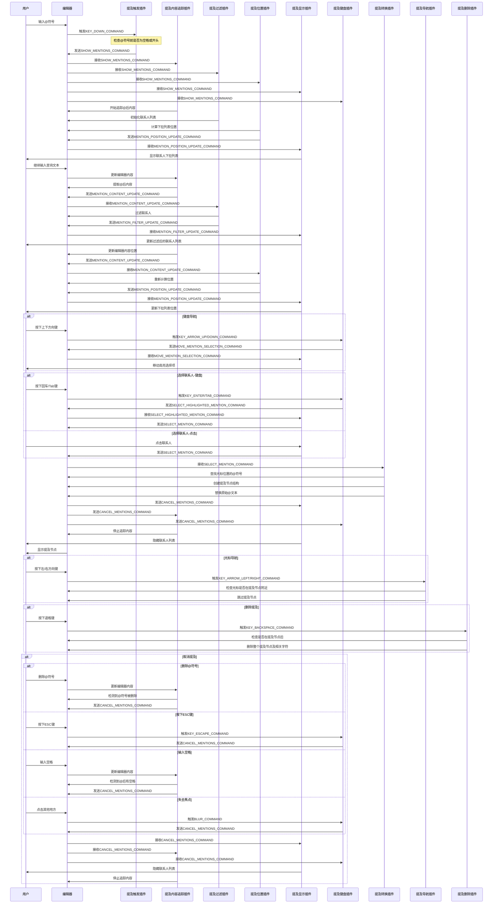

# 聊天输入组件开发文档

本文档提供聊天输入组件的技术实现细节和插件交互流程，主要面向开发者。用户指南请参考 [README.md](./README.md)。

## 插件命令交互详细图

提及功能涉及多个插件之间的协作，通过命令进行交互，下图展示了完整的命令流程和时序：



## 插件命令说明

以下是各插件使用的主要命令及其功能说明：

### 展示与隐藏命令
- `SHOW_MENTIONS_COMMAND`: 显示提及下拉列表
- `CANCEL_MENTIONS_COMMAND`: 隐藏提及下拉列表并取消提及状态

### 内容与位置更新命令
- `MENTION_CONTENT_UPDATE_COMMAND`: 更新@后的内容文本
- `MENTION_POSITION_UPDATE_COMMAND`: 更新提及下拉列表位置
- `MENTION_FILTER_UPDATE_COMMAND`: 更新过滤后的联系人列表

### 选择与导航命令
- `MOVE_MENTION_SELECTION_COMMAND`: 移动高亮选择项
- `SELECT_HIGHLIGHTED_MENTION_COMMAND`: 选择当前高亮的联系人
- `SELECT_MENTION_COMMAND`: 创建提及节点

## 插件工作流程解析

### 提及触发流程
1. 用户输入"@"符号
2. 触发插件检测到"@"符号并发送 `SHOW_MENTIONS_COMMAND`
3. 多个插件同时接收此命令并做出相应处理：
   - 内容追踪插件开始监听@后的内容变化
   - 过滤插件初始化联系人列表
   - 位置插件计算下拉列表的最佳位置
   - 显示插件渲染联系人下拉列表
   - 键盘插件开始监听键盘操作

### 联系人筛选流程
1. 用户在"@"后继续输入文字
2. 内容追踪插件检测到内容变化，提取@后的搜索文本
3. 内容追踪插件发送 `MENTION_CONTENT_UPDATE_COMMAND`
4. 过滤插件根据搜索文本过滤联系人列表
5. 过滤插件发送 `MENTION_FILTER_UPDATE_COMMAND`
6. 显示插件更新下拉列表，仅显示过滤后的联系人

### 选择联系人流程
1. 用户通过键盘或鼠标选择联系人
2. 选择命令传递到转换插件
3. 转换插件创建提及节点结构并替换原始@文本
4. 取消提及状态，隐藏下拉列表
5. 编辑器显示新创建的提及节点

### 取消提及流程
多种情况会触发取消提及流程：
1. 删除@符号
2. 按下ESC键
3. 输入空格
4. 编辑器失去焦点

这些情况都会发送 `CANCEL_MENTIONS_COMMAND`，导致：
- 显示插件隐藏联系人列表
- 内容追踪插件停止追踪@后内容
- 键盘插件停止监听特殊键盘操作

## 提及节点结构

提及节点使用 `MentionNode` 类实现，它具有以下特点：
- 继承自 `ElementNode`
- 具有 `isIsolated()` 特性，表示它是一个整体节点
- 包含用户名和用户ID信息
- 自定义渲染为带特殊样式的标签

### 节点在DOM中的表示
```html
<span 
  class="bg-blue-100 dark:bg-blue-800/30 rounded-md text-blue-700 dark:text-blue-300 px-1.5 py-0.5 mx-[1px] inline-flex items-center select-none" 
  data-mention-id="user123"
  data-lexical-mention="true"
  contentEditable="false"
>
  <span class="mr-0.5">@</span>
  <span>用户名</span>
</span>
```

### 节点前后的零宽空格
提及节点前后使用零宽空格（`\u200B`）确保光标可以正确定位，完整的节点结构为：
```
TextNode("之前的文本\u200B") → MentionNode("用户名", "ID") → TextNode("\u200B 之后的文本")
```

## 开发注意事项

### 插件间通信
- 使用命令进行松耦合通信，避免插件间直接依赖
- 命令通过编辑器实例传递，使用 `editor.dispatchCommand()` 发送
- 使用 `useEffect(() => { return editor.registerCommand(...) })` 监听命令

### 性能优化
- 位置计算使用节流（throttle）技术，避免频繁更新
- 使用 `useMemo` 缓存过滤结果，减少不必要的重新计算
- 使用 `React.memo` 优化下拉列表渲染性能

### 扩展建议
如需扩展提及功能，可考虑：
1. 添加提及分组显示
2. 实现提及数据异步加载
3. 增强提及节点的交互功能，如悬停显示详情
4. 优化移动设备上的体验 