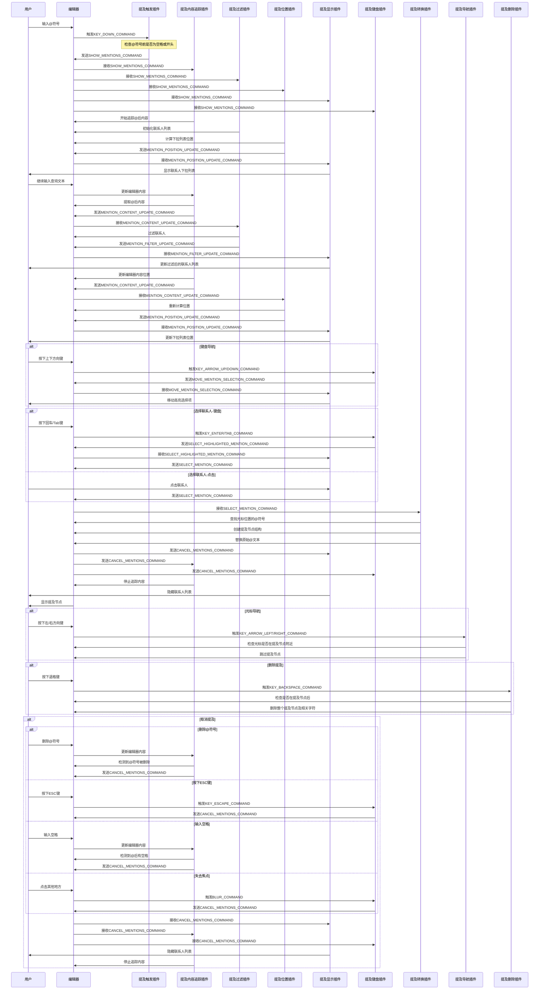

# 聊天输入组件

一个基于Lexical编辑器的聊天输入组件，支持@提及功能。

## 主要功能

- **基本文本输入**
  - 支持普通文本输入和编辑
  - 自动换行和滚动
  - 光标定位和选择

- **@提及联系人功能**
  - 输入@触发联系人列表
  - 实时过滤匹配联系人
  - 键盘导航和鼠标选择
  - 提及节点整体删除
  - 提及节点内容序列化
  - 焦点管理和无障碍支持

- **编辑器控制**
  - 自动聚焦控制
  - 内容变更事件
  - 初始内容设置
  - 编辑器实例引用

- **界面定制**
  - 占位文本设置
  - 自定义容器样式
  - 高度自适应

## 插件结构

组件使用模块化的插件结构，特别是@提及功能已被拆分为多个细粒度插件，每个插件负责特定功能：

### 提及功能插件协调图

```mermaid
%%{init: {'theme': 'dark', 'themeVariables': { 'primaryColor': '#242424', 'primaryTextColor': '#fff', 'primaryBorderColor': '#888', 'lineColor': '#d3d3d3', 'secondaryColor': '#2b2b2b', 'tertiaryColor': '#353535'}}}%%
flowchart TD
    MentionTriggerPlugin[MentionTriggerPlugin\n监听@符号输入] -- "触发@命令" --> MentionContentTrackerPlugin[MentionContentTrackerPlugin\n追踪@后内容]
    
    MentionContentTrackerPlugin -- "内容更新命令" --> MentionFilterPlugin[MentionFilterPlugin\n过滤联系人列表]
    
    MentionFilterPlugin -- "过滤更新命令" --> MentionDisplayPlugin[MentionDisplayPlugin\n显示联系人列表]
    
    MentionContentTrackerPlugin -- "内容更新命令" --> MentionPositionPlugin[MentionPositionPlugin\n计算列表位置]
    
    MentionPositionPlugin -- "位置更新命令" --> MentionDisplayPlugin
    
    MentionKeyboardPlugin[MentionKeyboardPlugin\n键盘导航] <-- "显示/隐藏命令" --> MentionDisplayPlugin
    
    MentionKeyboardPlugin -- "移动选择命令" --> MentionDisplayPlugin
    
    MentionKeyboardPlugin -- "选择联系人命令" --> MentionTransformsPlugin[MentionTransformsPlugin\n创建提及节点]
    MentionTransformsPlugin -- "创建提及节点" --> MentionNodePlugin[MentionNodePlugin\n渲染节点]
    
    MentionTriggerPlugin -- "监听" --> MentionCancellationPlugin[MentionCancellationPlugin\n取消提及]
    MentionCancellationPlugin -- "取消命令" --> MentionDisplayPlugin
    MentionCancellationPlugin -- "取消命令" --> MentionKeyboardPlugin
    
    MentionListPlugin[MentionListPlugin\n聚合插件] -. "包含" .-> MentionDisplayPlugin
    MentionListPlugin -. "包含" .-> MentionFilterPlugin
    MentionListPlugin -. "包含" .-> MentionPositionPlugin
    
    classDef functionality fill:#4682b4,stroke:#fff,stroke-width:1px,color:#fff
    classDef utility fill:#2e8b57,stroke:#fff,stroke-width:1px,color:#fff
    classDef core fill:#9932cc,stroke:#fff,stroke-width:1px,color:#fff
    classDef composite fill:#ff7f50,stroke:#fff,stroke-width:1px,color:#fff
    
    class MentionTriggerPlugin,MentionContentTrackerPlugin,MentionCancellationPlugin core
    class MentionKeyboardPlugin,MentionTransformsPlugin,MentionNodePlugin functionality
    class MentionDisplayPlugin,MentionFilterPlugin,MentionPositionPlugin utility
    class MentionListPlugin composite
```

### 插件命令交互详细图

提及功能涉及多个插件之间的协作，通过命令进行交互:



### 插件详细说明

#### @提及功能子插件

1. `MentionTriggerPlugin`: 
   - 监听@符号输入
   - 触发提及功能
   - 发送命令通知其他插件

2. `MentionContentTrackerPlugin`: 
   - 监听SHOW_MENTIONS_COMMAND命令
   - 追踪@后内容变化
   - 实时计算和传递搜索文本

3. `MentionCancellationPlugin`:
   - 监听失去焦点事件
   - 监测@符号是否被删除
   - 监测@后是否输入了空格或ESC键
   - 触发取消提及命令

4. `MentionDisplayPlugin`: 
   - 负责显示和隐藏联系人列表
   - 处理联系人选择逻辑
   - 管理下拉列表DOM渲染
   - 处理点击外部关闭列表
   - 响应键盘移动选择命令更新高亮项

5. `MentionFilterPlugin`:
   - 监听内容更新并过滤联系人
   - 根据搜索文本过滤联系人列表
   - 通知显示插件过滤后的结果

6. `MentionPositionPlugin`:
   - 计算下拉列表的最佳位置
   - 确保列表在视窗内
   - 窗口大小变化时重新计算位置
   - 通知显示插件更新位置

7. `MentionListPlugin`（聚合插件）:
   - 整合显示、过滤和位置三个子插件
   - 提供统一接口，简化使用
   - 向下兼容原有API

8. `MentionKeyboardPlugin`:
   - 监听提及列表的显示和隐藏状态
   - 处理键盘导航逻辑
   - 响应上下键移动选择
   - 管理回车选择联系人
   - 处理Tab和Esc键的行为
   - 发送移动选择命令给显示插件

9. `MentionTransformsPlugin`:
   - 创建提及节点并替换文本
   - 确保节点的正确位置和结构
   - 处理内容插入后的光标位置

10. `MentionNodePlugin`:
   - 负责提及节点的视觉渲染
   - 处理提及节点的删除操作
   - 确保整体删除行为
   - 提供节点的DOM元素

11. `MentionNavigationPlugin`:
   - 处理提及节点周围的光标键盘导航
   - 确保左右方向键能跳过提及节点
   - 提供平滑的光标体验
   
12. `MentionDeletionPlugin`:
   - 监听退格键在提及节点后的行为
   - 实现整体删除提及节点的功能
   - 处理零宽空格的删除逻辑

### 辅助插件

- `EditorRefPlugin`: 提供对编辑器实例的引用
- `OnChangePlugin`: 处理内容变更事件
- `TreeViewPlugin`: 调试工具，显示编辑器节点树
- `FocusDebugPlugin`: 调试工具，监控编辑器获取/失去焦点事件

## 自定义节点

- `MentionNode`: 表示提及的自定义节点类型

## @提及功能演示

1. 在输入框中输入@符号，会自动弹出联系人列表
2. 继续输入文字，联系人列表会根据输入内容进行过滤
3. 使用上/下方向键导航列表，回车或点击选择联系人
4. 选中后，@文本会转换为带特殊样式的提及节点
5. 删除提及时会整体删除该节点
6. 删除@符号或输入空格时，会自动取消提及状态

## API

### 组件使用

```tsx
<ChatInput
  contacts={contacts}
  onChange={handleChange}
  initialContent="初始内容"
  placeholder="输入消息..."
  autoFocus={true}
/>
```

### 必要属性

- `contacts`: 联系人列表，必须提供
  - 类型: `ChatContact[]`
  - 示例: `[{ id: '1', name: '用户名', isAI: false }]`

### 可选属性

- `onChange`: 内容变化回调
  - 类型: `(value: string) => void`
  - 默认值: `undefined`

- `initialContent`: 初始内容
  - 类型: `string`
  - 默认值: `''`

- `placeholder`: 占位文本
  - 类型: `string`
  - 默认值: `'输入消息...'`

- `className`: 自定义类名
  - 类型: `string`
  - 默认值: `''`

- `autoFocus`: 是否自动聚焦
  - 类型: `boolean`
  - 默认值: `true`

- `children`: 自定义子插件
  - 类型: `React.ReactNode`
  - 默认值: `undefined`