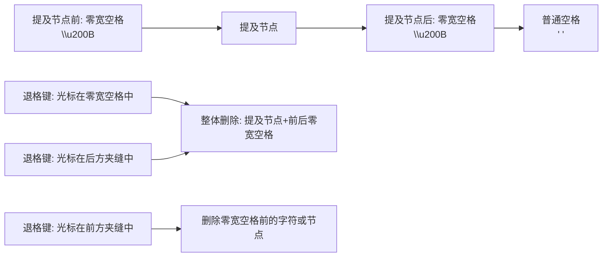
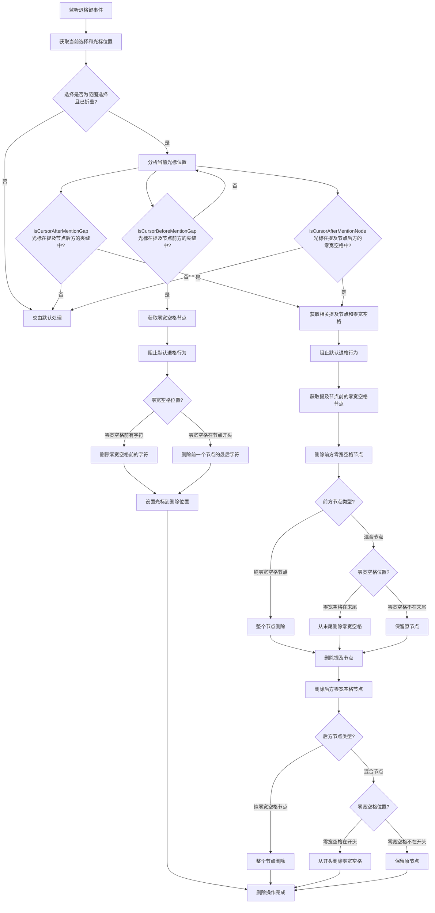

# 提及删除插件 (mention-deletion.plugin.tsx) 分析文档

## 1. 插件功能

提及删除插件(`mention-deletion.plugin.tsx`)是聊天输入组件中的一个核心插件，主要功能包括:

- 处理提及节点的退格键删除行为
- 确保提及节点作为一个整体被删除，包括其前后的零宽空格
- 监听退格键事件，在特定位置执行精确的删除操作
- 防止提及节点的部分删除导致的不一致状态
- 在提及节点前方夹缝位置支持特殊的删除行为，保护提及节点不被意外删除

## 2. 提及节点删除行为

提及节点在编辑器中的结构及删除行为如下:

删除行为说明:

1. **整体删除**: 当光标在提及节点后方时，提及节点被视为一个不可分割的整体，包括其前后的零宽空格一起被删除
2. **前方保护**: 当光标在提及节点前方"夹缝"中时，退格键不会删除提及节点，而是删除零宽空格前面的字符或节点
3. **触发条件**: 不同的光标位置触发不同的删除行为:
   - 在提及节点后的零宽空格中: 删除整个提及节点及其前后零宽空格
   - 在提及节点后方的"夹缝"中: 删除整个提及节点及其前后零宽空格
   - 在提及节点前方的"夹缝"中: 删除零宽空格前面的字符或前一个节点的最后一个字符
4. **智能处理**: 插件能智能处理各种边缘情况，如零宽空格与其他文本在同一节点时的部分删除

## 3. 退格键删除处理流程

插件会截获键盘退格键事件，并按以下流程处理:

核心处理逻辑:

1. **位置检测**: 
   - 使用`isCursorBeforeMentionGap`检查光标是否在提及节点前方夹缝中
   - 使用`isCursorAfterMentionGap`检查光标是否在提及节点后方夹缝中
   - 使用`isCursorAfterMentionNode`检查光标是否在提及节点后方零宽空格中
   - 根据不同位置选择不同的删除策略

2. **前方夹缝处理**: 
   - 获取零宽空格节点，检查零宽空格在节点中的位置
   - 如果零宽空格前有普通字符: 删除前一个字符，保留零宽空格和提及节点
   - 如果零宽空格在节点开头: 删除前一个节点的最后一个字符
   - 无论哪种情况，都会保留零宽空格和提及节点，并将光标移动到适当位置

3. **后方位置处理**:
   - 获取提及节点及其前后的零宽空格节点
   - 根据节点类型和零宽空格位置决定删除策略
   - 删除整个提及节点及其前后的零宽空格
   - 智能处理零宽空格与普通文本混合的情况

## 4. 重要注意事项

- 插件使用较低优先级(`COMMAND_PRIORITY_LOW`)注册退格键事件，允许其他高优先级处理程序先处理
- 只有当光标位于特定位置时才会接管退格键行为，其他情况下会交由默认处理
- 提及节点前方的"夹缝"位置被特殊处理，确保退格操作不会意外删除提及节点
- 后方位置的退格会删除整个提及节点（连同前后零宽空格）
- 前方位置的退格会保护提及节点，仅删除零宽空格前面的文本
- 支持智能处理零宽空格与普通文本混合的情况，维护编辑器内容的一致性
- 使用日志系统记录和调试删除过程的各个步骤
- 插件在组件卸载时会清理事件监听器，防止内存泄漏 