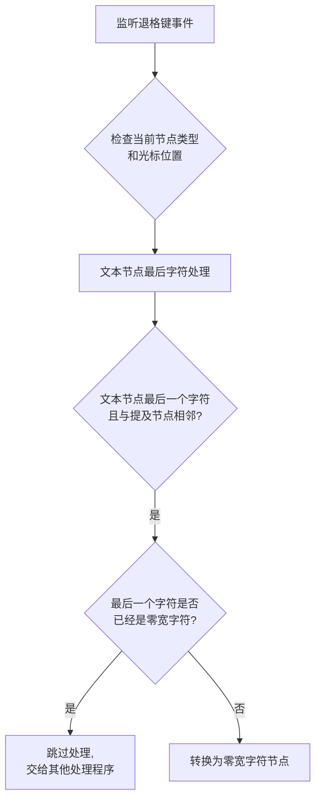

# 提及节点相邻文本退格处理插件

## 1. 插件功能概述

`MentionAdjacentTextBackspacePlugin` 是聊天输入组件中的一个专用插件，负责处理与提及节点（@用户）相邻的文本节点在退格键按下时的特殊处理。它主要解决以下问题：

- 防止删除与提及节点相邻的最后一个字符时导致节点结构不一致
- 确保与提及节点相邻时，至少保留一个零宽字符作为分隔符
- 如果删除的最后一个字符已经是零宽字符，则跳过处理，交给其他处理程序

## 2. 处理场景

插件处理以下场景：



### 文本节点最后字符处理

这是插件的核心功能，处理当删除文本节点的最后一个字符且该节点与提及节点相邻的情况：
- 如果当前光标位于文本节点的末尾
- 且该节点与提及节点相邻（前面或后面是提及节点）
- 且即将删除的是该节点的最后一个字符
- 如果最后一个字符已经是零宽字符，跳过处理，交给其他处理程序
- 否则，将该文本节点转换为零宽字符节点，而不是删除
- 确保提及节点之间或提及节点与其他内容之间有适当的分隔
- 这样做的目的是确保与提及节点相邻时，至少保留一个零宽字符作为分隔符

## 3. 技术实现细节

### 3.1 判断条件

插件使用以下条件来确定何时应该干预退格键行为：

```javascript
nodeText.length > 0 && offset === nodeText.length && 
(isPrevMention || isNextMention) && nodeText.length === 1 &&
nodeText !== '\u200B'
```
当满足此条件时，将最后一个字符转换为零宽字符，确保与提及节点相邻时至少保留一个零宽字符作为分隔符。如果最后一个字符已经是零宽字符，则跳过处理。

### 3.2 处理流程

1. 检查待删除字符是否为零宽字符
2. 如果是零宽字符，跳过处理，交给其他处理程序
3. 如果不是零宽字符：
   - 阻止默认的退格键行为
   - 将文本节点转换为零宽字符节点
   - 重新设置光标位置到零宽字符前

### 3.3 优先级

插件使用 `COMMAND_PRIORITY_NORMAL` 优先级进行处理。

## 4. 插件与其他组件的交互

该插件与以下组件协同工作：

- **MentionNodeDeletionPlugin**：负责在光标位于提及节点后文本节点开头位置时删除提及节点
- **MentionNode**：提及节点的核心实现
- **Lexical编辑器**：处理文本编辑和选择的核心框架

## 5. 示例场景

### 示例1：删除与提及节点相邻的最后一个字符

```
初始状态: @用户名 abc|
按退格键: @用户名 ab|
按退格键: @用户名 a|
按退格键: @用户名 |（此时'a'被转换为零宽字符）
```

### 示例2：删除已经是零宽字符的最后一个字符

```
初始状态: @用户名 [零宽字符]|
按退格键: |（此时交给其他处理程序，一般会删除提及节点）
```

## 6. 注意事项

- 插件使用零宽字符作为占位符，这些字符在视觉上不可见
- 当文本节点的最后一个字符与提及节点相邻时，会被转换为零宽字符而不是直接删除，确保提及节点之间始终有分隔
- 如果删除的最后一个字符已经是零宽字符，插件会跳过处理，交给其他处理程序
- 当插件激活时，会阻止默认的退格键行为并执行自定义逻辑
- 日志系统会记录插件的操作，便于调试和排查问题 