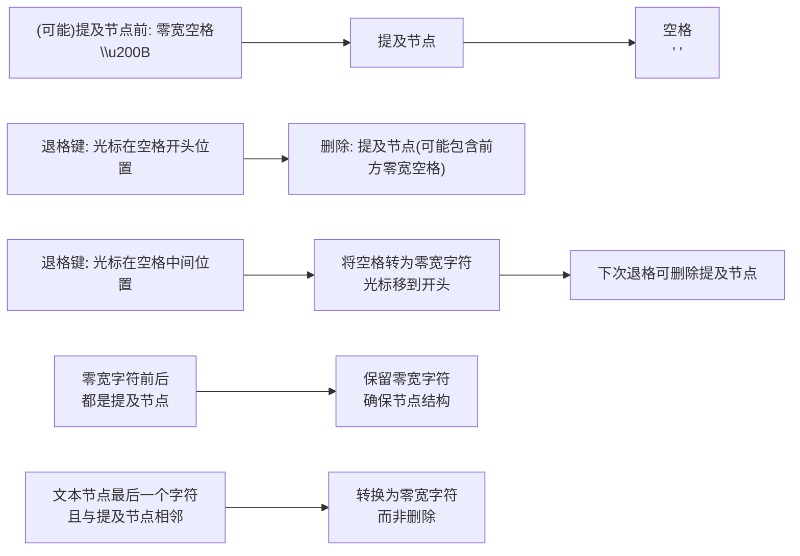
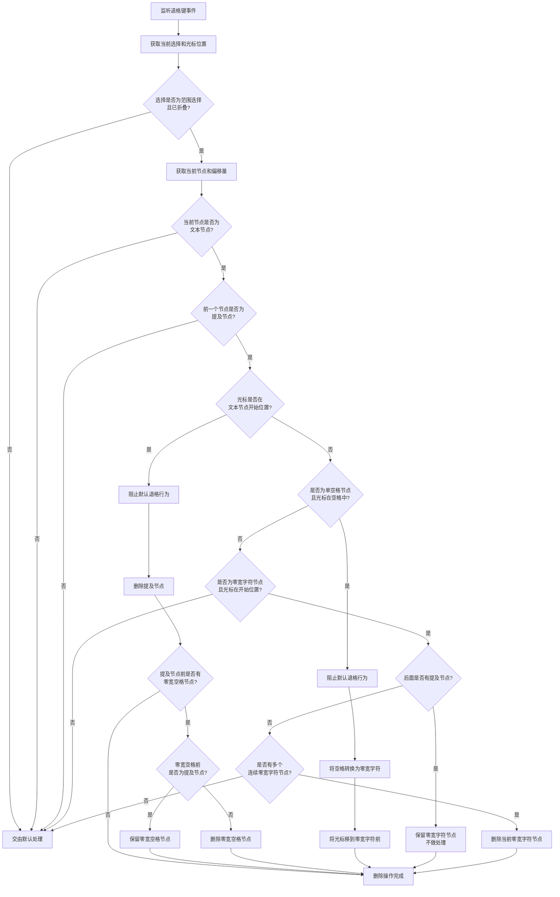

# 提及删除插件 (mention-deletion.plugin) 分析文档

## 1. 插件功能

提及删除插件(`mention-deletion.plugin`)是聊天输入组件中的一个核心插件，主要功能包括:

- 处理提及节点的退格键删除行为
- 确保提及节点作为一个整体被删除
- 监听退格键事件，在特定位置执行精确的删除操作
- 防止提及节点的部分删除导致的不一致状态
- 在特殊情况下将空格转换为零宽字符，以保持节点结构的一致性
- 当提及节点前后都有其他提及节点时，保留零宽字符节点，确保节点结构完整
- 处理与提及节点相邻的文本节点，确保删除最后一个字符时维持适当的节点结构

## 2. 提及节点删除行为

提及节点在编辑器中的结构及删除行为如下:

删除行为说明:

1. **整体删除**: 当光标在提及节点后方空格的开始位置时，提及节点被视为一个不可分割的整体被删除
2. **前方零宽空格**: 如果提及节点前有零宽空格节点，并且该节点前面不是提及节点时才会被删除
3. **空格转换**: 当光标在文本节点中的唯一空格字符位置按退格键时，将空格转换为零宽字符，并将光标移到开头
4. **两步删除**: 对于单空格文本节点，通过两步删除确保提及节点能被干净地删除：先转换为零宽字符，再触发提及节点删除
5. **零宽字符保留**: 当零宽字符节点前后都是提及节点时，保留该零宽字符节点，确保提及节点之间的结构完整
6. **冗余删除**: 如果存在多个连续的零宽字符节点，只保留一个，删除多余的节点
7. **相邻文本保护**: 当删除与提及节点相邻的文本节点的最后一个字符时，将其转换为零宽字符节点而非删除，保持节点结构

## 3. 退格键删除处理流程

插件会截获键盘退格键事件，并按以下流程处理:

## 4. 插件拆分与组合

为了提高代码的可维护性和单一职责，提及删除插件被拆分为以下子插件:

1. **MentionNodeDeletionPlugin**:
   - 负责处理提及节点的删除
   - 当光标在提及节点后的空格节点开始位置按退格键时触发
   - 特殊处理零宽字符节点的保留和删除逻辑
   - 使用 `COMMAND_PRIORITY_LOW` 优先级

2. **MentionAdjacentTextBackspacePlugin**:
   - 负责处理提及节点相邻文本的退格行为
   - 包括空格转零宽字符、零宽字符节点的保留/合并
   - 新增功能：处理删除与提及节点相邻的文本节点最后一个字符时的情况
   - 使用 `COMMAND_PRIORITY_NORMAL` 优先级，确保在节点删除前执行

3. **MentionDeletionPlugin**:
   - 主插件，组合以上两个子插件
   - 作为React组件返回两个子插件

这种拆分可以帮助我们更好地组织代码，便于测试和维护。

## 5. 重要注意事项

- 插件使用两个钩子处理不同场景的退格键行为
- `MentionAdjacentTextBackspacePlugin` 使用较高优先级(`COMMAND_PRIORITY_NORMAL`)，确保在提及节点删除钩子之前触发
- `MentionNodeDeletionPlugin` 使用较低优先级(`COMMAND_PRIORITY_LOW`)
- 只有当光标位于特定位置时才会接管退格键行为，其他情况下会交由默认处理
- 空格转零宽字符和相邻文本字符转零宽字符的机制确保了与提及节点相邻的文本操作不会破坏节点结构
- 零宽空格节点在提及节点前后都有提及节点时会被保留，确保节点结构完整
- 如果存在多个连续的零宽字符节点，只保留一个，删除多余的节点
- 使用日志系统记录和调试删除过程的各个步骤
- 插件在组件卸载时会清理所有事件监听器，防止内存泄漏 