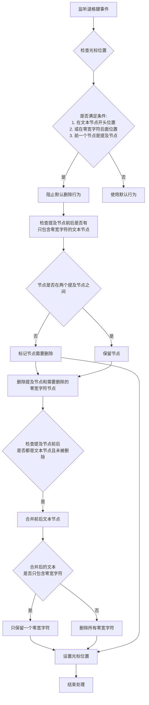

# 提及节点删除插件

## 1. 插件功能概述

`MentionNodeDeletionPlugin` 是聊天输入组件中专门处理提及节点（@用户）删除的插件。它主要解决以下问题：

- 当用户在提及节点后的文本节点开头位置按退格键时，实现提及节点的删除
- 当文本节点内容为零宽字符且光标位于零宽字符后面位置按退格键时，也实现提及节点的删除
- 检查并删除不在两个提及节点之间的零宽字符节点
- 确保删除提及节点后，前后文本节点能够正确合并，并处理好零宽字符
- 优化编辑体验，使提及节点的删除操作符合用户预期

## 2. 工作流程

插件的工作流程如下图所示：



## 3. 处理逻辑详解

### 3.1 触发条件

插件在以下条件之一满足时会处理退格键事件：

1. 当前选择是范围选择（光标选择）且已折叠（无选中文本）
2. 当前节点是文本节点
3. 满足以下条件之一：
   - 光标位置在文本节点的开头（offset === 0）
   - 文本节点内容是零宽字符，且光标位置在零宽字符后面（nodeText === '\u200B' && offset === 1）
4. 前一个节点是提及节点（MentionNode）

### 3.2 零宽字符节点检查

当触发删除提及节点时，插件会检查前后是否有只包含零宽字符的文本节点：

1. **检查提及节点前的节点**：
   - 如果是只包含零宽字符的文本节点，检查其前面是否为提及节点
   - 如果前面不是提及节点，标记该零宽字符节点需要删除

2. **检查提及节点后的节点**（当前节点）：
   - 如果是只包含零宽字符的文本节点，检查其后面是否为提及节点
   - 如果后面不是提及节点，标记该零宽字符节点需要删除

### 3.3 删除与合并流程

当满足触发条件后，插件会执行以下操作：

1. **阻止默认行为**：阻止浏览器默认的退格键行为
2. **删除提及节点**：移除文本节点前面的提及节点
3. **删除不必要的零宽字符节点**：
   - 删除所有标记为需要删除的零宽字符节点
   - 如果当前节点（提及节点后的节点）被删除，则设置光标位置并结束处理
4. **文本节点合并**：检查并处理以下情况：
   - 如果提及节点前后都是未被删除的文本节点，将它们合并成一个文本节点
   - 获取两个文本节点的内容并合并
5. **零宽字符处理**：
   - 如果合并后的文本包含非零宽字符：删除所有零宽字符
   - 如果合并后的文本只包含零宽字符：只保留一个零宽字符
6. **光标位置设置**：将光标设置在合并后文本的适当位置

### 3.4 零宽字符处理策略

零宽字符（`\u200B`）是不可见的字符，用于在提及节点前后帮助正确定位光标。处理策略如下：

- **位于两个提及节点之间的零宽字符节点**：保留，因为它们用于分隔提及节点
- **不在两个提及节点之间的零宽字符节点**：删除，因为它们不再需要
- **合并后文本处理**：
  - **存在普通字符时**：零宽字符不再需要，全部删除以保持文本纯净
  - **只有零宽字符时**：保留一个零宽字符，确保节点不为空并能正确定位光标

## 4. 示例场景

### 示例1：提及节点前后都有文本

```
初始状态: 你好 @用户名|测试
按退格键: 你好 |测试  (提及节点被删除，前后文本合并，零宽字符被删除)
```

### 示例2：提及节点前后只有零宽字符，且不在两个提及节点之间

```
初始状态: [零宽字符]@用户名|[零宽字符]
按退格键: |  (提及节点和零宽字符节点都被删除)
```

### 示例3：提及节点在两个提及节点之间

```
初始状态: 文本@用户1[零宽字符]@用户2|[零宽字符]@用户3
按退格键: 文本@用户1[零宽字符]|[零宽字符]@用户3  (只删除中间的提及节点，保留零宽字符节点)
```

### 示例4：零宽字符后面位置删除提及节点

```
初始状态: 文本@用户名[零宽字符|]
按退格键: 文本|  (提及节点和零宽字符节点都被删除)
```

## 5. 注意事项

- 插件会智能检测零宽字符节点是否需要保留，避免不必要的节点存在
- 删除提及节点时，会同时删除不在两个提及节点之间的零宽字符节点
- 删除提及节点后会自动处理前后文本节点的合并，避免文档结构碎片化
- 零宽字符的处理逻辑确保了文档结构的一致性和光标定位的准确性
- 插件现在支持两种触发条件：文本节点开头位置按退格键，或零宽字符后面位置按退格键
- 插件使用 `COMMAND_PRIORITY_LOW` 优先级，确保其他处理程序有机会先处理
- 日志系统会记录删除过程的各个步骤，便于调试和问题排查 