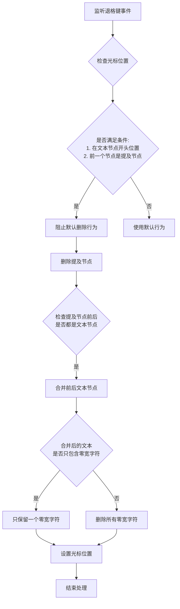

# 提及节点删除插件

## 1. 插件功能概述

`MentionNodeDeletionPlugin` 是聊天输入组件中专门处理提及节点（@用户）删除的插件。它主要解决以下问题：

- 当用户在提及节点后的文本节点开头位置按退格键时，实现提及节点的删除
- 确保删除提及节点后，前后文本节点能够正确合并，并处理好零宽字符
- 优化编辑体验，使提及节点的删除操作符合用户预期

## 2. 工作流程

插件的工作流程如下图所示：



## 3. 处理逻辑详解

### 3.1 触发条件

插件仅在以下条件全部满足时才会处理退格键事件：

1. 当前选择是范围选择（光标选择）且已折叠（无选中文本）
2. 当前节点是文本节点
3. 光标位置在文本节点的开头（offset === 0）
4. 前一个节点是提及节点（MentionNode）

### 3.2 删除与合并流程

当满足触发条件后，插件会执行以下操作：

1. **阻止默认行为**：阻止浏览器默认的退格键行为
2. **删除提及节点**：移除文本节点前面的提及节点
3. **文本节点合并**：检查并处理以下情况：
   - 如果提及节点前后都是文本节点，将它们合并成一个文本节点
   - 获取两个文本节点的内容并合并
4. **零宽字符处理**：
   - 如果合并后的文本包含非零宽字符：删除所有零宽字符
   - 如果合并后的文本只包含零宽字符：只保留一个零宽字符
5. **光标位置设置**：将光标设置在合并后文本的适当位置

### 3.3 零宽字符处理策略

零宽字符（`\u200B`）是不可见的字符，用于在提及节点前后帮助正确定位光标。处理策略如下：

- **存在普通字符时**：零宽字符不再需要，全部删除以保持文本纯净
- **只有零宽字符时**：保留一个零宽字符，确保节点不为空并能正确定位光标

## 4. 示例场景

### 示例1：提及节点前后都有文本

```
初始状态: 你好 @用户名|测试
按退格键: 你好 |测试  (提及节点被删除，前后文本合并，零宽字符被删除)
```

### 示例2：提及节点前后只有零宽字符

```
初始状态: [零宽字符]@用户名|[零宽字符]
按退格键: [零宽字符]|  (提及节点被删除，只保留一个零宽字符)
```

## 5. 注意事项

- 插件使用 `COMMAND_PRIORITY_LOW` 优先级，确保其他处理程序有机会先处理
- 删除提及节点后会自动处理前后文本节点的合并，避免文档结构碎片化
- 零宽字符的处理逻辑确保了文档结构的一致性和光标定位的准确性
- 日志系统会记录删除过程的各个步骤，便于调试和问题排查 