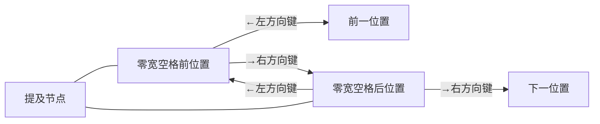
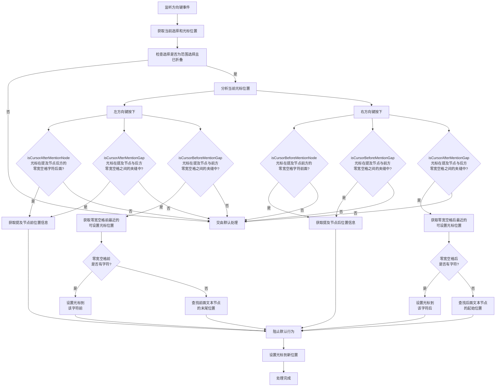

# 提及导航插件 (mention-navigation.plugin.tsx) 分析文档

## 1. 插件功能

提及导航插件(`mention-navigation.plugin.tsx`)是聊天输入组件中的一个核心插件，主要功能包括:

- 处理提及节点周围的光标键盘左右移动
- 确保用户在编辑过程中将提及节点视为一个整体
- 防止光标卡在提及节点的中间状态
- 通过监听左右方向键事件实现光标的精确跳转

## 2. 提及节点导航行为

提及节点的导航行为遵循以下原则:

导航行为说明:

1. **向左导航**: 无论光标在提及节点后方还是后方空隙，都直接跳到提及节点前方
2. **向右导航**: 无论光标在提及节点前方还是前方空隙，都直接跳到提及节点后方
3. **整体性原则**: 提及节点在编辑过程中被视为一个整体，光标不会在提及节点内部停留

需要注意的是：
- **重要**: 插件确保光标总是跳转到提及节点前后的适当位置，而不会在中间状态
- 借助零宽空格字符实现光标的精确定位
- 通过拦截和修改默认的光标移动行为来实现平滑导航体验

## 3. 左右键导航处理流程

插件会截获键盘左右方向键事件，并按以下流程处理:

核心处理逻辑:

1. **左方向键处理**: 
   - 检查光标是否在提及节点后方或后方空隙，如是，获取提及节点前的位置信息
   - 检查光标是否在提及节点前方空隙，如是，获取零宽空格前最近的可设置光标位置：
     - 如果零宽空格前有字符，设置光标到该字符前
     - 如果零宽空格是文本节点中唯一字符，查找前面的文本节点末尾位置
   - 设置光标到确定的位置
   
2. **右方向键处理**: 
   - 检查光标是否在提及节点前方或前方空隙，如是，获取提及节点后的位置信息
   - 检查光标是否在提及节点后方空隙，如是，获取零宽空格后最近的可设置光标位置：
     - 如果零宽空格后有字符，设置光标到该字符后
     - 如果零宽空格是文本节点中唯一字符，查找后面的文本节点起始位置
   - 设置光标到确定的位置

3. **位置获取**:
   - 使用`getMentionNodeBeforePosition`获取提及节点前的位置
   - 使用`getMentionNodeAfterPosition`获取提及节点后的位置
   - 查找零宽空格前后最近的可设置光标位置
     - 检查相邻字符
     - 当需要时，跳过非文本节点找到最近的文本节点的适当位置

4. **光标设置**:
   - 创建新的范围选择
   - 设置选择的锚点和焦点到目标位置
   - 提交选择更新

## 4. 重要注意事项

- 插件依赖于提及节点的标准结构，包括前后零宽空格的存在
- 光标必须能够在提及节点前后定位，这是实现正确导航行为的关键
- 插件通过高优先级(`COMMAND_PRIORITY_HIGH`)拦截方向键事件
- 只有当光标在提及节点周围时才会处理事件，其他情况交由默认处理
- 日志系统用于记录和调试插件行为
- 插件在组件卸载时会清理事件监听器 