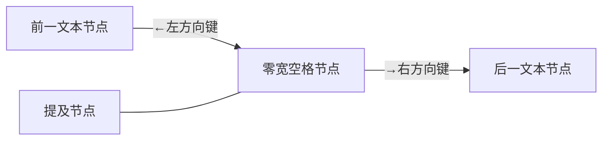
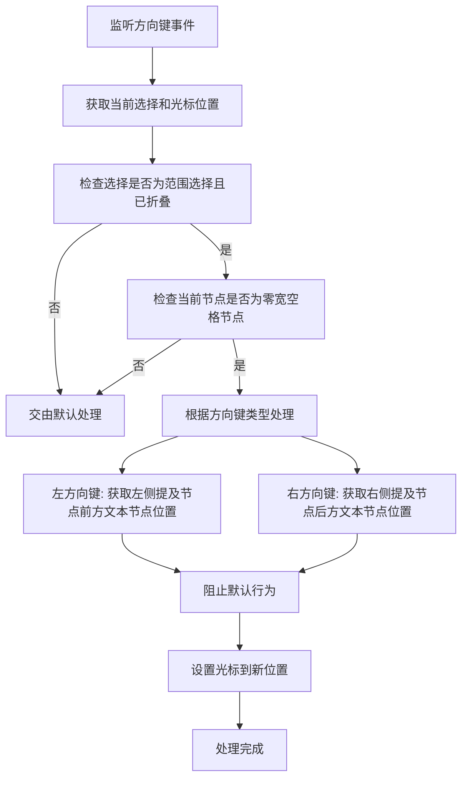

# 提及导航插件 (mention-navigation.plugin.tsx) 分析文档

## 1. 插件功能

提及导航插件(`mention-navigation.plugin.tsx`)是聊天输入组件中的一个核心插件，主要功能包括:

- 处理提及节点周围的光标键盘左右移动
- 确保用户在编辑过程中将提及节点视为一个整体
- 防止光标卡在提及节点的中间状态
- 通过监听左右方向键事件实现光标的精确跳转

## 2. 提及节点导航行为

提及节点的导航行为遵循以下原则:



导航行为说明:

1. **向左导航**: 
   - 当光标在零宽空格文本节点中时，直接跳到相邻提及节点前方文本节点的末尾位置
   - 只适用于纯零宽空格文本节点（只包含一个零宽字符）

2. **向右导航**: 
   - 当光标在零宽空格文本节点中时，直接跳到相邻提及节点后方文本节点的开始位置
   - 只适用于纯零宽空格文本节点（只包含一个零宽字符）

3. **整体性原则**: 
   - 提及节点在编辑过程中被视为一个整体，光标不会在提及节点内部停留

## 3. 提及节点结构

提及节点在文档中的标准结构如下：

```
[零宽空格文本节点] [提及节点] [空格文本节点]
```

对于特殊情况的处理：

1. **段落开始位置的提及节点**:
   - 即使提及节点位于段落的开始位置，也会在其前方插入零宽空格节点
   - 这确保了光标可以始终正确定位到提及节点的前方
   - 通过检查提及节点是否是段落的第一个子节点，或其前置节点是空文本节点来判断

2. **零宽空格节点**:
   - 前方零宽空格节点：确保光标可以定位到提及节点前方
   - 后方空格节点：确保光标可以定位到提及节点后方，并提供空格以分隔后续文本

这种结构设计确保了提及节点在任何位置都能保持一致的导航行为。

## 4. 左右键导航处理流程

插件会截获键盘左右方向键事件，并按以下流程处理:



核心处理逻辑:

1. **基础判断**:
   - 检查光标是否处于有效的范围选择中
   - 检查当前节点是否为零宽空格节点

2. **方向处理**:
   - 左方向键：获取左侧提及节点前方文本节点位置，并将光标移动到其末尾
   - 右方向键：获取右侧提及节点后方文本节点位置，并将光标移动到其开始位置

3. **关键实现函数**:
   - `isZeroWidthSpaceNode`: 判断节点是否是零宽空格节点
   - `getAdjacentMentionPosition`: 核心函数，根据指定方向获取相邻提及节点的位置

4. **光标设置**:
   - 创建新的范围选择
   - 设置选择的锚点和焦点到目标位置
   - 提交选择更新

## 5. 重要注意事项

- 插件不再依赖外部cursor-utils工具方法，降低了代码耦合度
- 只处理纯零宽空格节点（只包含单个零宽字符）的导航
- 简化了判断逻辑，提高代码清晰度和性能
- 插件通过高优先级(`COMMAND_PRIORITY_HIGH`)拦截方向键事件
- 只有当光标在零宽空格节点上时才会处理事件，其他情况交由默认处理
- 日志系统用于记录和调试插件行为
- 插件在组件卸载时会清理事件监听器 