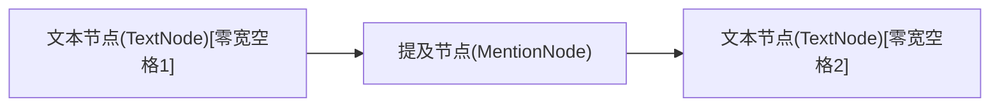

# 提及转换插件 (mention-transforms.plugin.tsx) 分析文档

## 1. 插件功能

提及转换插件(`mention-transforms.plugin.tsx`)是聊天输入组件中的一个核心插件，主要功能包括:

- 接收并处理用户选择联系人的指令
- 将编辑器中的`@`符号和后续查询文本转换为提及节点
- 创建并维护标准格式的提及节点结构
- 确保转换后的光标位置正确

## 2. 提及节点标准结构

提及节点的标准结构如下:



标准结构说明:

1. **零宽空格前文本节点**: 类型为`TextNode`，包含一个零宽空格字符(`\u200B`)和可能的其他文本，此零宽空格**必须**存在于提及节点前
2. **提及节点**: 类型为`MentionNode`(继承自`ElementNode`)，包含联系人信息，实现为不可编辑的独立节点
3. **零宽空格后文本节点**: 类型为`TextNode`，包含一个零宽空格字符(`\u200B`)和可能的其他文本，此零宽空格**必须**存在于提及节点后

需要注意的是：
- **重要**: 前后文本节点必须包含零宽空格字符，但也可以包含用户输入的其他文本内容
- 提及节点设置为`isIsolated()`返回true，意味着它是独立节点，不参与文本合并
- 零宽空格字符使光标能够在提及节点前后定位，是实现正确光标行为的关键


## 3. @符号查找和替换流程

插件会从当前光标位置向前查找@符号，然后进行替换:

```mermaid
flowchart TD
    A[接收SELECT_MENTION_COMMAND] --> B[获取当前选择和光标位置]
    B --> C[获取光标所在文本节点]
    C --> D1[检查是否为文本节点]
    D1 -->|是| D[从光标位置向前查找最近的@符号]
    D1 -->|否| F[记录警告并结束]
    D --> D2{查找过程中是否遇到非文本节点?}
    D2 -->|是| F[记录警告并结束]
    D2 -->|否| E{找到@符号?}
    E -->|否| F[记录警告并结束]
    E -->|是| G[提取@符号及之后到光标位置的全部内容]
    G --> H[创建标准节点结构]
    H --> I[前文本节点：仅包含一个零宽空格]
    I --> J[提及节点：包含联系人信息]
    J --> K[后文本节点：零宽空格+空格字符]
    K --> L[替换从@符号到光标位置的内容为标准节点结构]
    L --> M[设置光标位置到零宽空格+空格后]
    M --> N[处理完成]
```

核心处理逻辑:

1. **@符号查找**: 从光标位置向前查找最近一个@符号
   - 查找必须在连续的文本节点中进行
   - 如果在向前查找过程中遇到非文本节点，应立即停止查找
   - 不允许跨越非文本节点继续查找，因为@提及必须存在于连续的文本内容中
2. **提取内容**: 提取包括@符号在内到光标位置的所有内容
3. **创建标准结构**: 
   - 创建前文本节点，仅包含一个零宽空格字符(`\u200B`)
   - 创建提及节点，包含联系人信息
   - 创建后文本节点，包含一个零宽空格字符(`\u200B`)后跟一个空格字符
4. **内容替换**: 用创建的标准节点结构替换从@符号到光标位置的全部原始内容
5. **调整光标**: 将光标位置设置到后文本节点中的空格字符后

## 4. 重要注意事项

- @符号查找必须在连续的文本节点中进行，遇到非文本节点应立即停止
- 不允许跨越非文本节点继续查找，确保@提及存在于连续的文本内容中
- 前文本节点仅包含一个零宽空格字符，后文本节点包含零宽空格加一个普通空格
- 如果找不到@符号，则记录警告并结束处理
- 替换操作完成后，光标应位于后文本节点中的空格字符后
- 最终生成的标准节点结构需要保持文档的一致性和可靠性 