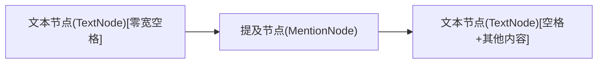

# 提及转换插件 (mention-transforms.plugin.tsx) 分析文档

## 1. 插件功能

提及转换插件(`mention-transforms.plugin.tsx`)是聊天输入组件中的一个核心插件，主要功能包括:

- 接收并处理用户选择联系人的指令
- 将编辑器中的`@`符号和后续查询文本转换为提及节点
- 创建并维护标准格式的提及节点结构
- 确保转换后的光标位置正确

## 2. 提及节点标准结构

提及节点的标准结构如下:



标准结构说明:

1. **零宽空格前文本节点**: 类型为`TextNode`，包含一个零宽空格字符(`\u200B`)，此零宽空格**必须**存在于提及节点前
2. **提及节点**: 类型为`MentionNode`(继承自`ElementNode`)，包含联系人信息，实现为不可编辑的独立节点
3. **空格后文本节点**: 类型为`TextNode`，以空格字符开头，可能包含其他内容，空格字符**必须**存在于提及节点后

需要注意的是：
- 前文本节点必须存在且包含零宽字符，确保光标可以定位到提及节点前
- 后文本节点必须存在且以空格开头，确保光标可以定位到提及节点后
- 提及节点设置为`isIsolated()`返回true，意味着它是独立节点，不参与文本合并


## 3. @符号查找和替换流程

插件会从当前光标位置向前查找@符号，然后进行替换和节点创建:

```mermaid
flowchart TD
    A[接收SELECT_MENTION_COMMAND] --> B[获取当前选择和光标位置]
    B --> C[获取光标所在文本节点]
    C --> D1[检查是否为文本节点]
    D1 -->|是| D[从光标位置向前查找最近的@符号]
    D1 -->|否| F[记录警告并结束]
    D --> D2{查找过程中是否遇到非文本节点?}
    D2 -->|是| F[记录警告并结束]
    D2 -->|否| E{找到@符号?}
    E -->|否| F[记录警告并结束]
    E -->|是| G[提取@符号及之后到光标位置的全部内容]
    G --> H[创建提及节点]
    H --> H1[分割文本，保留@符号前的内容]
    H1 --> H2[将提及节点插入到原文本节点后]

    H2 --> I1{提及节点前是否有节点?}
    I1 -->|否| I2[创建零宽字符文本节点]
    I1 -->|是| I3{前面节点是否为文本节点?}
    I3 -->|否| I4[创建零宽字符文本节点]
    I3 -->|是| I5[保持前文本节点不变]

    H2 --> J0{光标后是否有文本?}
    J0 -->|是| J01[创建包含剩余文本的节点]
    J0 -->|否| J02[不创建剩余文本节点]
    
    J01 --> J1{提及节点后是否有节点?}
    J02 --> J1
    J1 -->|否| J2[创建空格文本节点]
    J1 -->|是| J3{后面节点是否为文本节点?}
    J3 -->|否| J4[创建空格文本节点]
    J3 -->|是| J5{文本节点是否以空格开头?}
    J5 -->|否| J6[在文本内容前添加空格]
    J5 -->|是| J7[保持后文本节点不变]

    I2 --> K[设置光标位置到后文本节点空格后]
    I5 --> K
    I4 --> K
    J2 --> K
    J4 --> K
    J6 --> K
    J7 --> K
    K --> L[处理完成]
```

核心处理逻辑:

1. **@符号查找**: 从光标位置向前查找最近一个@符号
   - 查找必须在连续的文本节点中进行
   - 如果在向前查找过程中遇到非文本节点，应立即停止查找
   - 不允许跨越非文本节点继续查找，因为@提及必须存在于连续的文本内容中

2. **提取内容**: 提取包括@符号在内到光标位置的所有内容

3. **创建提及节点**: 使用`$createMentionNode`创建提及节点

4. **文本分割和节点插入**:
   - 分割原文本节点，保留@符号前的内容
   - 将提及节点插入到原文本节点后面
   - 如果光标后还有文本，创建包含剩余文本的节点

5. **前置节点处理**:
   - 如果提及节点前没有节点，创建包含零宽字符的文本节点
   - 如果提及节点前的节点不是文本节点，创建包含零宽字符的文本节点
   - 如果提及节点前已经是文本节点，保持不变

6. **后置节点处理**:
   - 如果提及节点后没有节点，创建包含空格的文本节点
   - 如果提及节点后的节点不是文本节点，创建包含空格的文本节点
   - 如果提及节点后已经是文本节点但不以空格开头，在文本内容前添加空格
   - 如果提及节点后已经是文本节点且以空格开头，保持不变

7. **光标位置设置**: 将光标设置到后文本节点的空格后

## 4. 重要注意事项

- @符号查找必须在连续的文本节点中进行，遇到非文本节点应立即停止
- 不允许跨越非文本节点继续查找，确保@提及存在于连续的文本内容中
- 提及节点前必须有文本节点且包含零宽字符，提及节点后必须有文本节点且以空格开头
- 前后节点处理逻辑已简化，只关注节点是否存在以及类型，不再特殊处理段落开头位置
- 文本分割和节点插入逻辑由插件处理，而不是提及节点创建方法
- 插件会智能判断前后节点情况，并采取相应处理策略
- 前后节点处理策略确保了文档结构的一致性和光标定位的准确性
- 光标最终会被设置在提及节点后的空格字符之后 