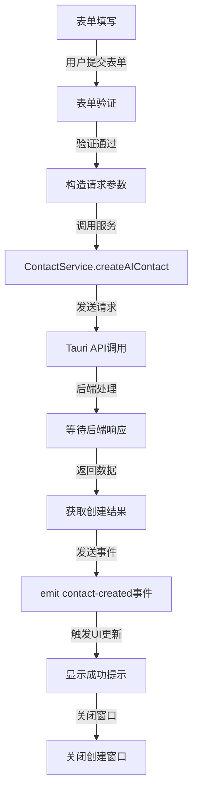
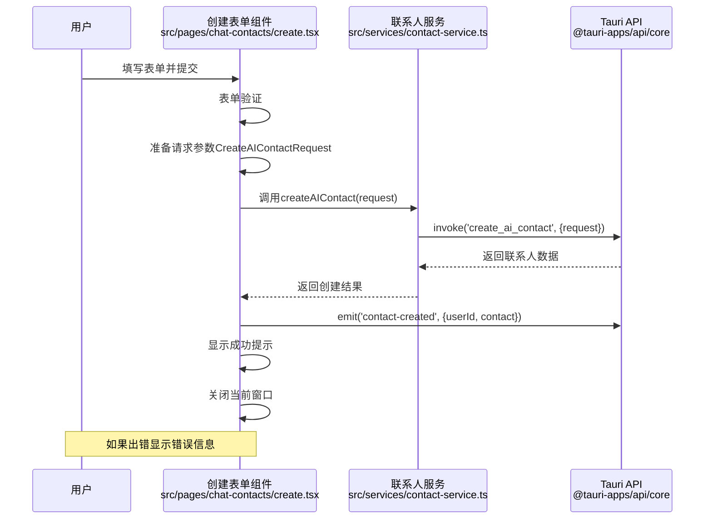
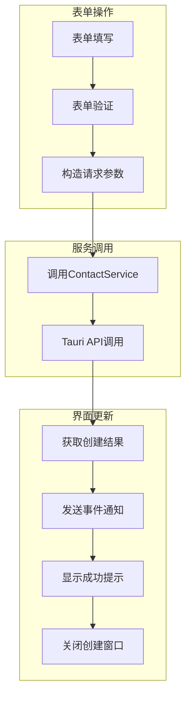
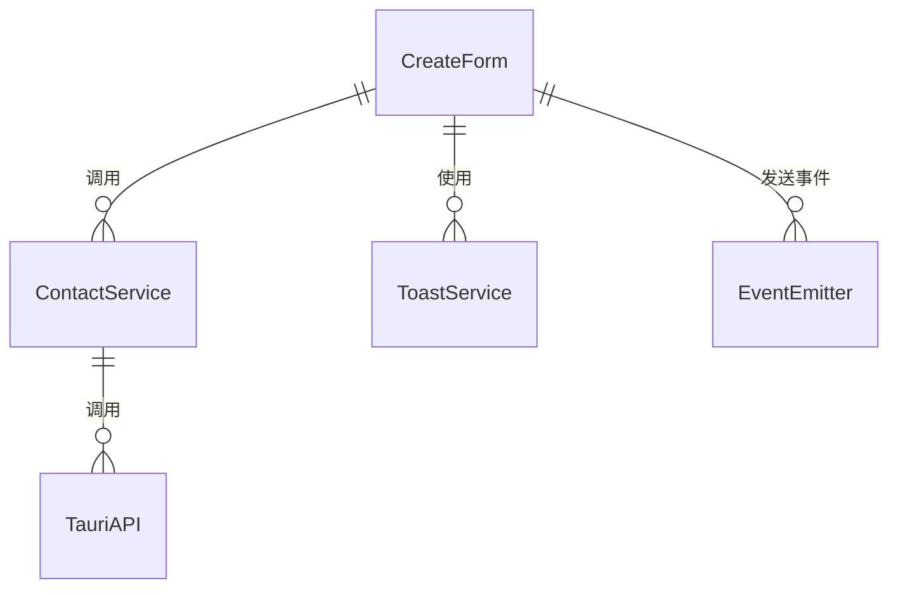

# 创建AI联系人前端流程

本文档描述了在前端创建AI联系人的流程，从表单填写到服务调用的过程。

## 整体流程



## 详细流程



## 数据流图



## 组件关系



## 关键代码解析

### 1. 表单提交处理 (src/pages/chat-contacts/create.tsx)

```tsx
async function onSubmit(values: AgentFormValues) {
  // 确保头像URL已设置
  values.avatarUrl = currentAvatarUrl;

  // 创建AI联系人请求
  const contactRequest: CreateAIContactRequest = {
    name: values.name,
    model_name: values.modelName,
    system_prompt: values.systemPrompt,
    temperature: values.temperature,
    max_tokens: values.maxTokens,
    top_p: values.topP,
    avatar_url: values.avatarUrl,
    description: values.description,
    is_streaming: true, // 添加流式输出属性（始终为true）
    group_id: values.groupId,
    owner_user_id: user.id, // 使用当前用户的ID
  };

  try {
    // 调用服务创建AI联系人
    const newContact = await contactService.createAIContact(contactRequest);

    // 发送事件通知，通知联系人列表刷新
    await emit('contact-created', {
      userId: user.id,
      contact: {
        id: newContact.id,
        name: newContact.name,
        description: newContact.description,
        group_id: newContact.group_id,
      },
    });

    toast.success('创建成功', {
      description: `机器人 "${values.name}" 已创建`,
    });
    // 提交成功后关闭当前窗口
    await closeCurrentWindow();
  } catch (error) {
    console.error('创建联系人出错:', error);
    toast.error('创建失败', {
      description: error instanceof Error ? error.message : '请检查网络连接或联系管理员',
    });
  }
}
```

### 2. 联系人服务API调用 (src/services/contact-service.ts)

```typescript
/**
 * 创建AI联系人（原子操作）
 *
 * 这个方法执行以下步骤：
 * 1. 创建Agent
 * 2. 创建AI用户
 * 3. 更新Agent关联到AI用户
 * 4. 创建联系人用户链接
 * 5. 创建联系人
 *
 * @param request 创建AI联系人请求
 * @returns 创建的联系人信息
 */
async createAIContact(request: CreateAIContactRequest): Promise<Contact> {
  return await invoke<Contact>('create_ai_contact', { request });
}
```

### 3. 请求参数结构定义 (src/services/contact-service.ts)

```typescript
// 创建AI联系人请求接口
export interface CreateAIContactRequest {
  // Agent参数
  name: string;
  model_name: string;
  system_prompt: string;
  temperature: number;
  max_tokens?: number;
  top_p?: number;
  avatar_url?: string;
  description?: string | null;
  is_streaming: boolean;

  // 联系人参数
  group_id: string;
  owner_user_id: string; // 拥有者用户ID
}
```

## 完整处理流程

1. **表单填写与验证**：

   - 用户在创建页面填写AI联系人信息，包括名称、模型、系统提示词等
   - 使用react-hook-form + zod进行表单验证
   - 验证通过后，构造CreateAIContactRequest对象

2. **服务调用**：

   - 调用contactService.createAIContact方法
   - 该方法通过Tauri的invoke API调用后端命令

3. **结果处理**：

   - 获取创建结果
   - 发送contact-created事件通知其他组件更新
   - 显示成功提示
   - 关闭创建窗口

4. **错误处理**：
   - 捕获可能的错误
   - 显示错误提示
   - 记录错误日志

## 界面表单组件结构

创建AI联系人的表单包括三个主要部分：

1. **基本信息**：

   - 头像（可随机生成）
   - 名称
   - 所属分组（可创建新分组）
   - 描述

2. **模型配置**：

   - 选择模型（从Ollama获取或使用预设）
   - 系统提示词

3. **高级参数**：
   - 温度（Temperature）
   - 最大生成长度（Max Tokens）
   - Top P

表单使用react-hook-form进行状态管理，并使用zod进行验证规则定义，确保输入数据的合法性。

## 注意事项

1. **用户体验**：提供成功/失败反馈，操作完成后自动关闭窗口
2. **错误处理**：完善的错误捕获和提示机制
3. **事件通知**：使用事件机制通知其他组件更新，避免手动刷新
4. **参数验证**：前端进行参数验证，确保数据合法性
