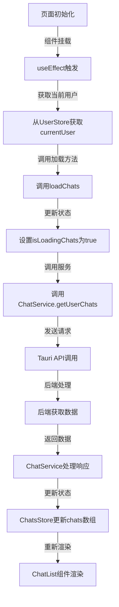
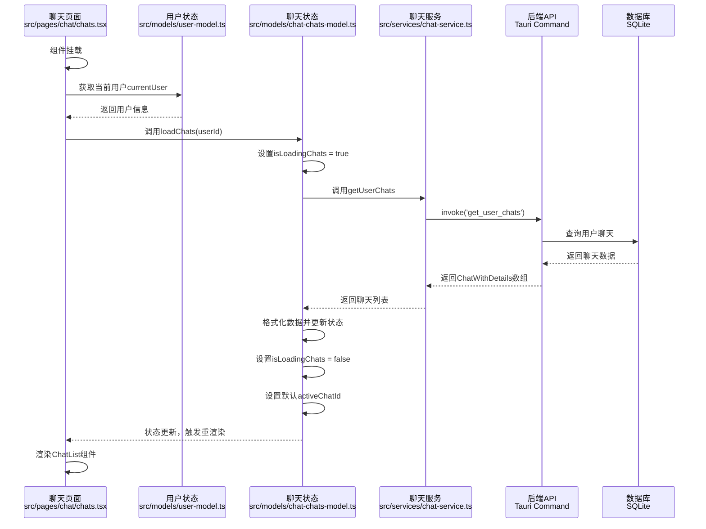
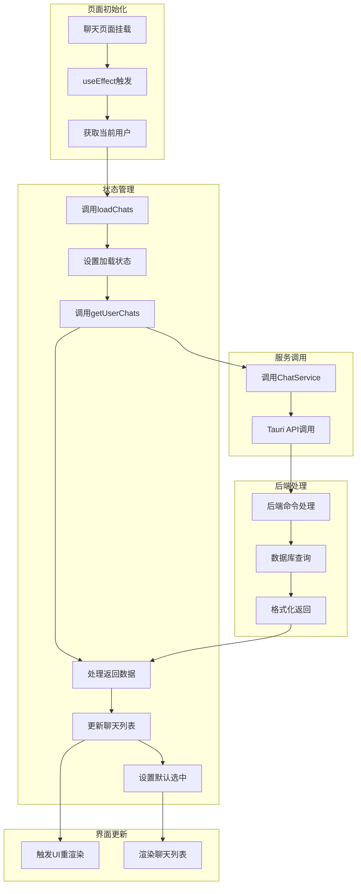
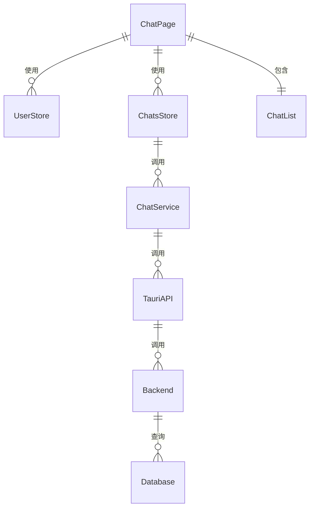

# 加载用户聊天列表流程

本文档描述了聊天页面加载用户聊天列表的完整流程，从页面初始化到数据获取、状态更新及UI渲染的处理步骤。

## 整体流程



## 详细流程



## 数据流图



## 组件关系



## 关键代码解析

### 1. 聊天页面初始化并加载数据 (src/pages/chat/chats.tsx)

```tsx
// 初始化加载聊天列表
useEffect(() => {
  if (currentUser) {
    loadChats(currentUser.id);
  }

  // 清除会话状态
  return () => {
    clearCurrentConversation();
  };
}, [currentUser, loadChats, clearCurrentConversation]);
```

### 2. ChatsStore中的loadChats方法 (src/models/chat-chats-model.ts)

```typescript
loadChats: async userId => {
  try {
    set(state => {
      state.isLoadingChats = true;
      state.loadError = null;
      return state;
    });

    // 使用优化版的API获取聊天列表
    const chatsWithDetails = await chatService.getUserChats({
      user_id: userId,
      include_empty: false,
      sort_by: 'last_message_time',
    });

    // 转换为前端使用的格式
    const chats: Chat[] = chatsWithDetails.map(chat => ({
      id: chat.id,
      name: chat.title,
      avatar: chat.title.charAt(0).toUpperCase(),
      lastMessage: chat.last_message_content || null,
      lastMessageTime: chat.last_message_time
        ? new Date(chat.last_message_time).toLocaleString()
        : null,
      unread: chat.unread_count,
      type: chat.type_,
    }));

    set(state => {
      state.chats = chats;
      state.isLoadingChats = false;

      // 如果有聊天，默认选中第一个
      if (state.chats.length > 0 && !state.activeChatId) {
        state.activeChatId = state.chats[0].id;
      }

      return state;
    });
  } catch (error) {
    set(state => {
      state.isLoadingChats = false;
      state.loadError = error instanceof Error ? error.message : '加载聊天列表失败';
      return state;
    });

    console.error('加载聊天列表失败:', error);
    throw error;
  }
};
```

### 3. 聊天服务API调用 (src/services/chat-service.ts)

```typescript
/**
 * 获取用户的聊天列表（优化版）
 * @param request 获取用户聊天列表请求
 * @returns 带有详细信息的聊天列表
 */
async getUserChats(request: GetUserChatsRequest): Promise<ChatWithDetails[]> {
  return await invoke<ChatWithDetails[]>('get_user_chats', { request });
}
```

### 4. 聊天列表渲染 (src/components/chat-list)

```typescript
// 聊天列表组件渲染
return (
  <div className="chat-list">
    {isLoadingChats ? (
      <div className="loading">加载中...</div>
    ) : loadError ? (
      <div className="error">{loadError}</div>
    ) : chats.length === 0 ? (
      <div className="empty-list">暂无聊天</div>
    ) : (
      chats.map(chat => (
        <div
          key={chat.id}
          className={`chat-item ${activeChatId === chat.id ? 'active' : ''}`}
          onClick={() => onChatSelect(chat.id)}
        >
          <div className="avatar">{chat.avatar}</div>
          <div className="info">
            <div className="name">{chat.name}</div>
            <div className="last-message">{chat.lastMessage}</div>
          </div>
          <div className="meta">
            {chat.lastMessageTime && <div className="time">{chat.lastMessageTime}</div>}
            {chat.unread > 0 && <div className="unread">{chat.unread}</div>}
          </div>
        </div>
      ))
    )}
  </div>
);
```

## 完整处理流程

1. 聊天页面组件挂载后，通过useEffect触发加载流程
2. 从UserStore获取当前登录用户信息
3. 调用ChatsStore的loadChats方法，传入用户ID
4. ChatsStore设置加载状态标志，通知UI显示加载指示器
5. ChatsStore调用ChatService的getUserChats方法，请求用户聊天列表
6. ChatService通过Tauri API调用后端命令
7. 后端执行SQL查询，获取用户参与的所有聊天及详细信息
8. 后端将数据格式化为前端所需的ChatWithDetails对象数组
9. ChatService接收数据并返回给ChatsStore
10. ChatsStore处理数据，转换为前端组件需要的格式
11. ChatsStore更新状态，设置聊天列表和默认选中项
12. UI重新渲染，显示最新的聊天列表

## 优化要点

1. **使用新的优化API**：调用getUserChats替代旧的getChatsWithDetailsByUserId，减少数据库查询
2. **灵活的过滤和排序**：支持排除空聊天、指定排序方式等
3. **状态管理优化**：使用Zustand + immer提供不可变状态更新
4. **高效的UI渲染**：ChatList组件仅依赖必要的状态，避免不必要的重渲染
5. **用户体验提升**：自动选择第一个聊天，减少用户操作步骤
6. **错误处理**：提供完善的错误处理机制，增强应用稳定性
