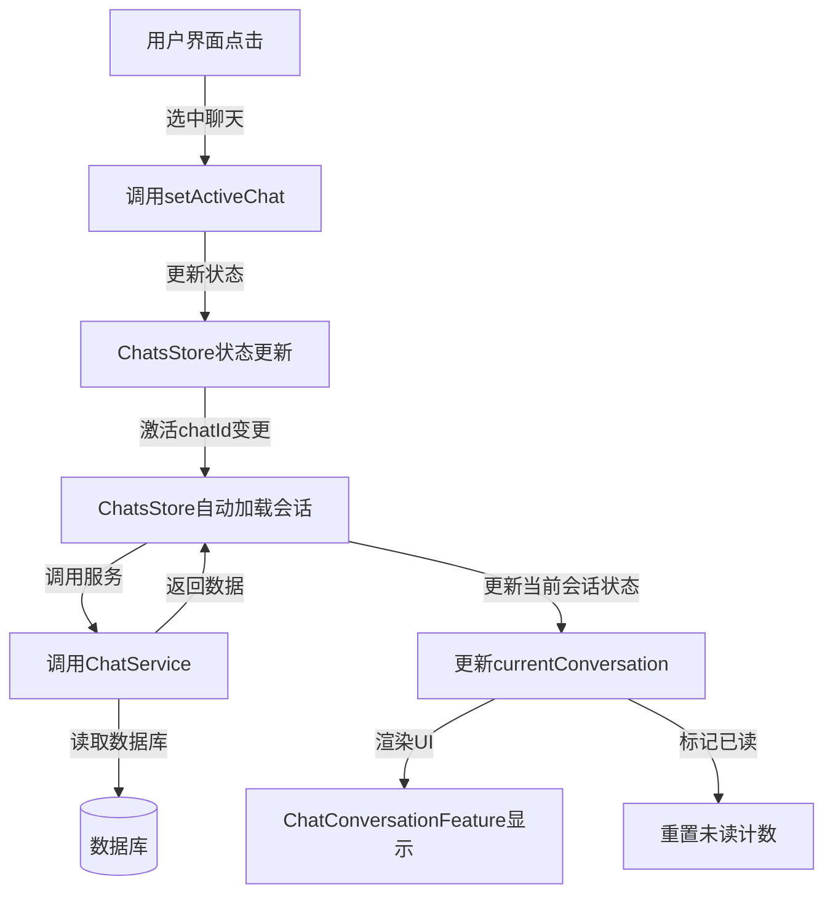
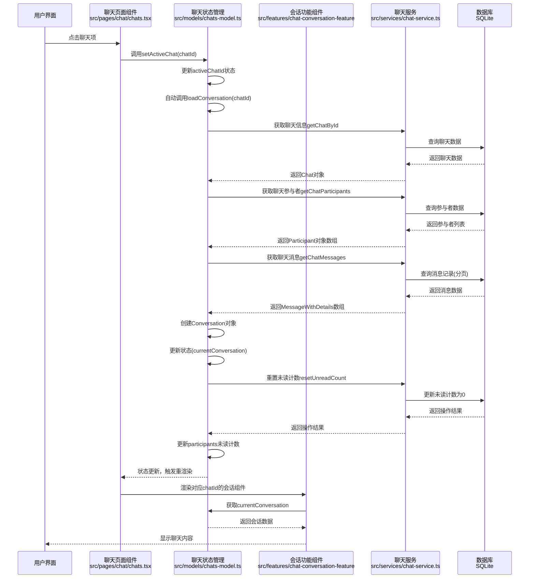
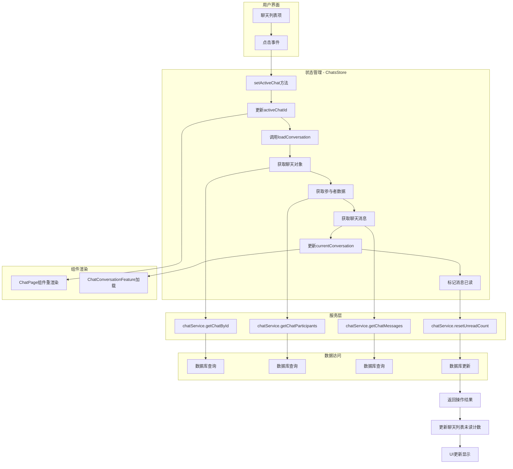
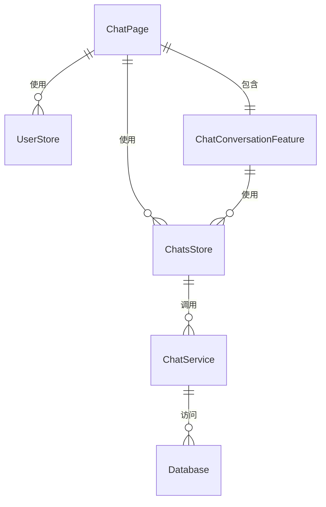

# 选中聊天的流程文档

本文档描述了在聊天页面选中聊天的完整流程，从UI交互到数据流向和状态更新的处理步骤。

## 整体流程



## 详细流程



## 数据流图



## 组件关系



## 关键代码解析

### 1. 聊天列表项点击处理 (src/pages/chat/chats.tsx)

```tsx
// 聊天列表项渲染与点击处理
filteredChats.map(chat => (
  <div
    key={chat.id}
    onClick={() => setActiveChat(chat.id)}
    className={`flex items-center p-3 cursor-pointer transition-all ${activeChatId === chat.id ? 'bg-blue-50 dark:bg-gray-700' : ''}`}
  >
    {/* 聊天项内容 */}
  </div>
));
```

### 2. ChatsStore中的状态更新和自动加载会话 (src/models/chats-model.ts)

```typescript
setActiveChat: (chatId) => {
  set(state => {
    state.activeChatId = chatId;
    return state;
  });

  // 激活聊天后，立即加载会话
  const currentUser = useAppStore.getState().currentUser;
  if (currentUser && chatId) {
    get().loadConversation(chatId);
  }
},
```

### 3. 加载会话并获取消息 (src/models/chats-model.ts)

```typescript
loadConversation: async (chatId: string) => {
  try {
    set(state => {
      state.isLoadingConversation = true;
      state.loadError = null;
    });

    // 获取当前用户
    const currentUser = useAppStore.getState().currentUser;
    if (!currentUser) {
      throw new Error('未登录');
    }

    // 获取聊天信息
    const chat = await chatService.getChatById(chatId);

    // 获取聊天参与者
    const participants = await get().getChatParticipants(chatId);

    // 获取聊天消息
    const messages = await get().loadMessages(chatId);

    // 创建会话对象并更新状态
    set(state => {
      state.currentConversation = {
        id: chat.id,
        chatId: chat.id,
        title: chat.title,
        type: chat.type_,
        participants: participants,
        messages: messages,
        // ... 其他属性
      };
      state.isLoadingConversation = false;
    });

    // 标记为已读
    await get().resetUnreadCount(chatId, currentUser.id);
  } catch (err) {
    // 处理错误
  }
};
```

### 4. 会话组件获取数据并显示 (src/features/chat-conversation-feature.tsx)

```typescript
// 使用聊天store
const { loadConversation, sendMessage, currentConversation, isLoadingConversation, loadError } =
  useChatsStore();

// 监听currentConversation变化，更新activeChat
useEffect(() => {
  if (currentConversation) {
    setActiveChat({
      id: currentConversation.chatId,
      name: currentConversation.title,
      avatar: currentConversation.title.charAt(0).toUpperCase(),
    });
  }
}, [currentConversation]);

// 加载消息
const handleLoadMessages = async () => {
  return currentConversation ? currentConversation.messages : [];
};
```

### 5. 获取聊天消息 (src/services/chat-service.ts)

```typescript
/**
 * 获取聊天消息列表
 * @param request 获取聊天消息请求
 * @returns 消息列表及详情
 */
async getChatMessages(request: GetChatMessagesRequest): Promise<MessageWithDetails[]> {
  return await invoke<MessageWithDetails[]>('get_chat_messages', { request });
}
```

## 注意事项

1. 选中聊天时，ChatsStore中的activeChatId会更新
2. activeChatId变更会触发自动加载会话数据
3. 会话数据包括聊天详情、参与者信息和消息列表
4. 加载会话后，同时获取聊天消息并自动标记为已读
5. 加载会话后，会自动标记消息为已读并重置未读计数
6. 整个流程遵循单向数据流模式，符合React最佳实践
7. 状态管理使用Zustand，采用immer中间件实现不可变数据更新
8. 聊天数据全部存储在ChatsStore中，不再需要单独的会话存储
