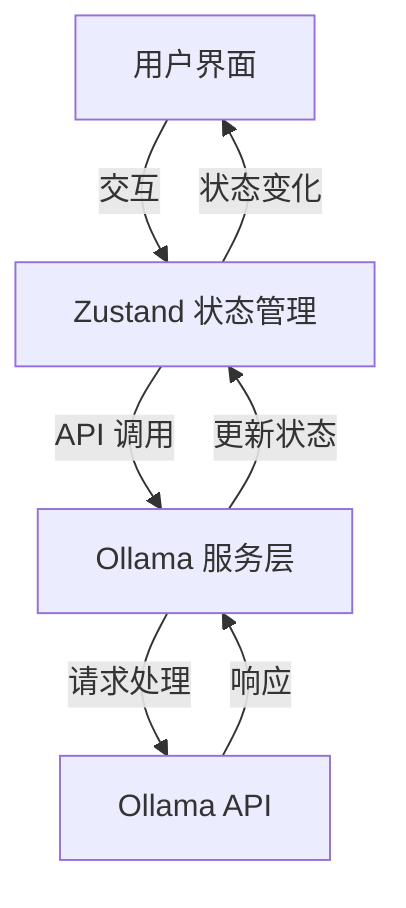
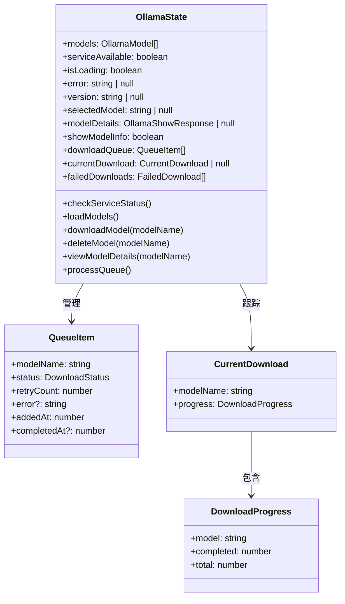
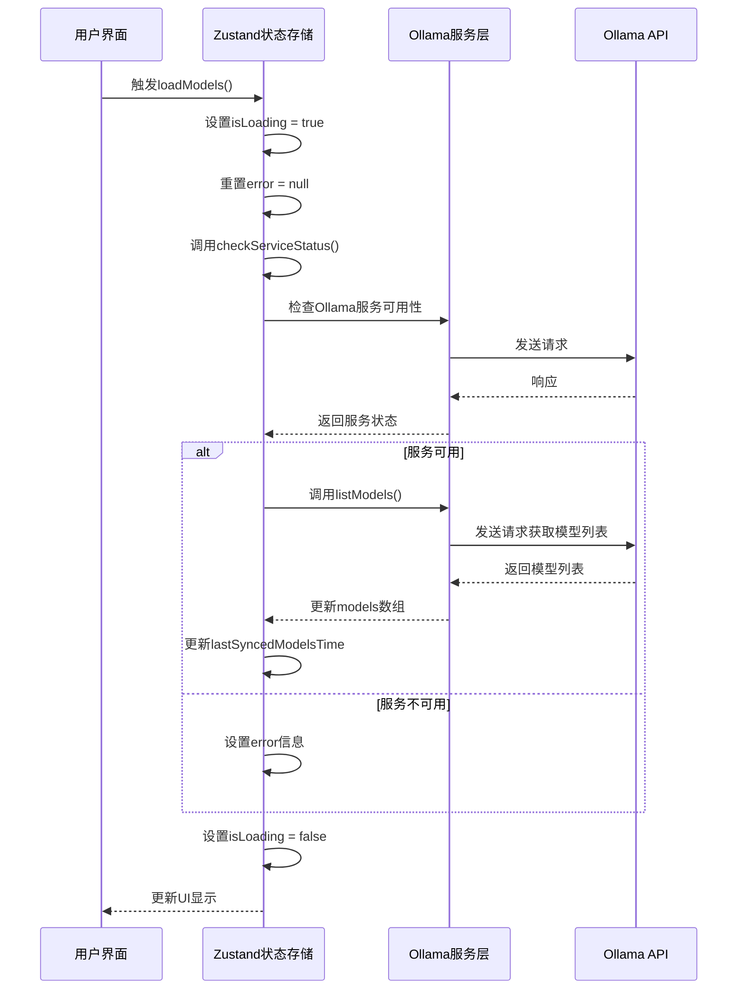
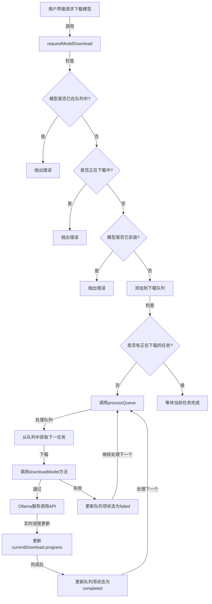
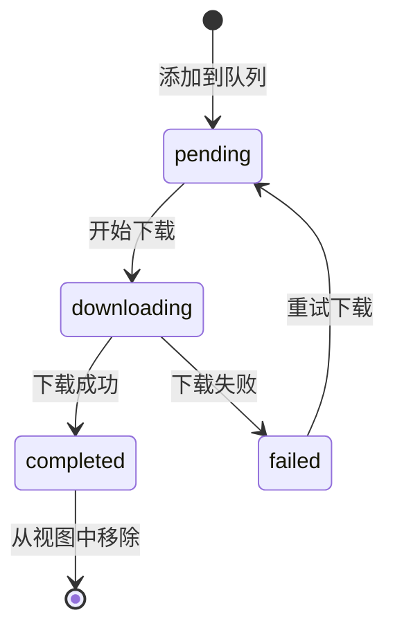
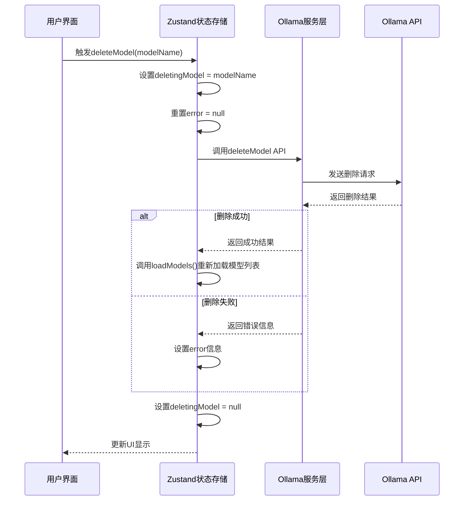
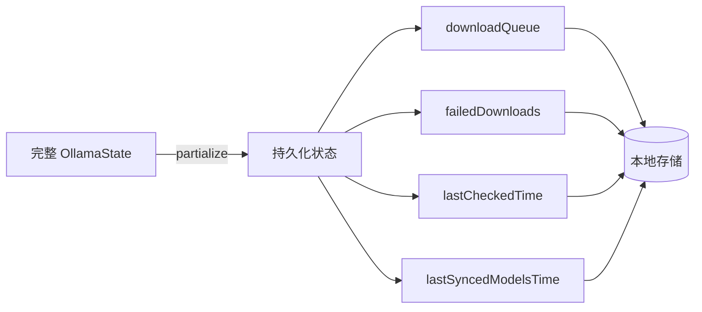
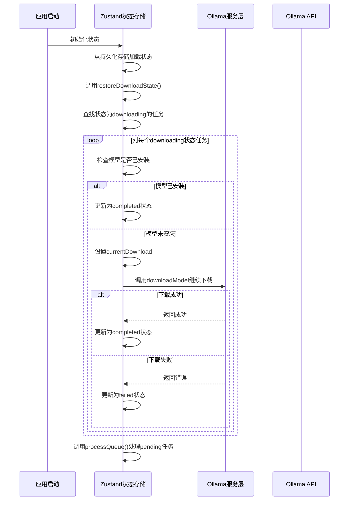
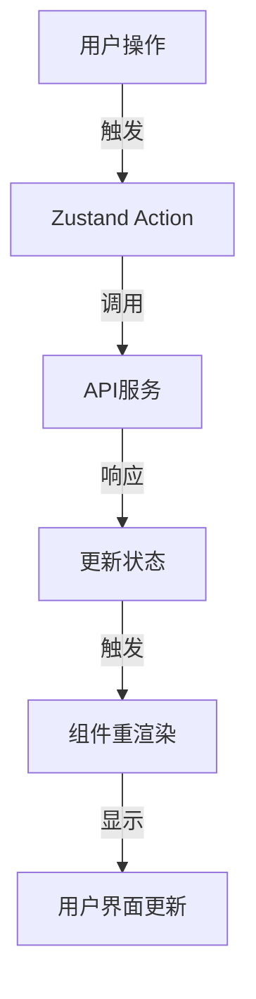

# Ollama 模型状态管理文档

本文档描述了 Ollama 模型管理的状态管理设计、数据流和工作流程，包括模型查询、下载和删除操作的完整流程。

## 整体状态管理架构



## 主要状态和组件



### 核心状态字段详解

#### OllamaState 主要字段

| 字段                 | 类型                       | 含义                     | 使用场景                                             |
| -------------------- | -------------------------- | ------------------------ | ---------------------------------------------------- |
| models               | OllamaModel[]              | 已安装的 Ollama 模型列表 | 显示用户已安装的 AI 模型列表，提供模型选择界面       |
| serviceAvailable     | boolean                    | Ollama 服务可用状态      | 判断 Ollama 后台服务是否正常运行，显示连接状态指示器 |
| isLoading            | boolean                    | 加载状态标志             | 控制加载指示器显示，防止用户重复操作                 |
| error                | string \| null             | 错误信息                 | 显示友好的错误提示，帮助用户排查问题                 |
| version              | string \| null             | Ollama 服务版本          | 显示当前 Ollama 版本，提供版本兼容性提示             |
| selectedModel        | string \| null             | 当前选中的模型名称       | 用于标识当前查看详情或操作的模型                     |
| modelDetails         | OllamaShowResponse \| null | 模型详细信息             | 显示模型参数、大小、许可证等详细信息                 |
| showModelInfo        | boolean                    | 模型详情显示状态         | 控制模型详情弹窗或面板的显示与隐藏                   |
| downloadQueue        | QueueItem[]                | 下载队列                 | 管理和显示待下载和正在下载的模型列表                 |
| currentDownload      | CurrentDownload \| null    | 当前下载任务             | 显示当前正在下载的模型和进度信息                     |
| failedDownloads      | FailedDownload[]           | 下载失败记录             | 显示失败的下载任务，提供重试选项                     |
| lastCheckedTime      | number \| null             | 服务最后检查时间         | 控制服务状态检查频率，显示最后检查时间               |
| lastSyncedModelsTime | number \| null             | 模型列表最后同步时间     | 控制模型列表刷新频率，显示最后更新时间               |

#### OllamaState 主要方法

| 方法                 | 参数              | 功能                 | 使用场景                                    |
| -------------------- | ----------------- | -------------------- | ------------------------------------------- |
| checkServiceStatus   | 无                | 检查 Ollama 服务状态 | 应用启动时、网络恢复后、用户手动触发检查    |
| loadModels           | 无                | 加载已安装模型列表   | 应用启动时、安装/删除模型后、用户刷新列表时 |
| downloadModel        | modelName: string | 下载指定模型         | 用户请求下载新模型时                        |
| deleteModel          | modelName: string | 删除指定模型         | 用户请求删除不需要的模型时                  |
| viewModelDetails     | modelName: string | 查看模型详情         | 用户点击模型详情按钮时                      |
| setShowModelInfo     | show: boolean     | 设置模型详情显示状态 | 显示/隐藏模型详情弹窗                       |
| setNewModelName      | name: string      | 设置新模型名称       | 用户在输入框中输入模型名称时                |
| resetError           | 无                | 重置错误状态         | 用户确认错误消息后、重试操作前              |
| requestModelDownload | modelName: string | 请求下载模型         | 用户提交模型下载请求时                      |
| processQueue         | 无                | 处理下载队列         | 队列状态变化时、新任务添加时、任务完成时    |
| restoreDownloadState | 无                | 恢复下载状态         | 应用重启后恢复中断的下载任务                |

#### QueueItem 字段

| 字段        | 类型                | 含义       | 使用场景                                         |
| ----------- | ------------------- | ---------- | ------------------------------------------------ |
| modelName   | string              | 模型名称   | 标识队列中的模型                                 |
| status      | DownloadStatus      | 下载状态   | 显示模型当前下载状态（等待、下载中、失败、完成） |
| retryCount  | number              | 重试次数   | 记录下载失败后的重试次数，限制最大重试次数       |
| error       | string \| undefined | 错误信息   | 显示下载失败原因                                 |
| addedAt     | number              | 添加时间戳 | 显示任务添加时间，用于排序                       |
| completedAt | number \| undefined | 完成时间戳 | 显示任务完成时间，用于计算耗时                   |

#### CurrentDownload 字段

| 字段      | 类型             | 含义             | 使用场景                 |
| --------- | ---------------- | ---------------- | ------------------------ |
| modelName | string           | 当前下载模型名称 | 显示正在下载的模型名     |
| progress  | DownloadProgress | 下载进度         | 显示实时下载进度和进度条 |

#### DownloadProgress 字段

| 字段      | 类型   | 含义         | 使用场景                       |
| --------- | ------ | ------------ | ------------------------------ |
| model     | string | 模型名称     | 标识进度所属的模型             |
| completed | number | 已完成字节数 | 计算下载百分比，显示已下载大小 |
| total     | number | 总字节数     | 计算下载百分比，显示总大小     |

### 下载状态流转

下载队列中的任务状态转换遵循以下规则：

1. **pending（等待中）**：任务初始状态，等待处理
2. **downloading（下载中）**：正在下载模型文件
3. **completed（已完成）**：下载成功完成
4. **failed（失败）**：下载过程中发生错误

状态流转过程中的处理逻辑：

- 任务从 pending 转为 downloading 时，设置 currentDownload 字段
- 任务完成时从 downloading 转为 completed，并设置 completedAt 字段
- 任务失败时从 downloading 转为 failed，并记录错误信息
- 用户可以将 failed 状态的任务重置为 pending 状态重试下载

## 模型加载流程



## 模型下载流程



## 下载队列状态转换



## 模型删除流程



## 状态持久化设计

Ollama 状态使用 Zustand 的 persist 中间件进行持久化处理，但只持久化必要的状态数据：



## 恢复下载状态流程



## 主要功能说明

1. **服务状态检查**：

   - 检查 Ollama 服务是否可用
   - 获取 Ollama 版本信息
   - 定期更新状态

2. **模型管理**：

   - 加载已安装模型列表
   - 查看模型详细信息
   - 删除不需要的模型

3. **下载队列管理**：

   - 添加模型到下载队列
   - 实时跟踪下载进度
   - 处理下载失败和重试逻辑
   - 恢复中断的下载任务

4. **状态持久化**：
   - 保存下载队列状态
   - 记录服务检查和同步时间
   - 应用重启后恢复下载

## 数据类型概览

### 主要状态类型

- **OllamaState**：核心状态容器，包含所有 Ollama 相关状态
- **QueueItem**：表示下载队列中的一个任务
- **CurrentDownload**：当前正在下载的模型信息
- **DownloadProgress**：下载进度信息

### 下载状态枚举

- **pending**：等待下载
- **downloading**：正在下载
- **failed**：下载失败
- **completed**：下载完成

## 错误处理策略

1. **服务不可用**：

   - 显示友好错误信息
   - 定期重试连接
   - 提供排查步骤

2. **下载失败**：

   - 记录错误原因
   - 提供重试机制
   - 支持批量重试失败任务

3. **删除失败**：
   - 显示具体错误原因
   - 更新模型列表以反映最新状态

## 最佳实践

1. **应用重启后恢复下载**：

   - 自动检测中断的下载任务
   - 继续处理队列中的任务
   - 保持下载进度一致性

2. **队列管理**：

   - 一次只处理一个下载任务
   - 按添加顺序处理队列
   - 支持对失败任务进行重试

3. **状态同步**：
   - 定期检查服务状态
   - 在关键操作后刷新模型列表
   - 实时更新下载进度

## 前端实现示例

用户界面中使用 Zustand 状态示例：

```typescript
import { useOllamaStore } from '../models/routes/chat-settings-ollama.model';

// 组件中使用 Zustand 状态
function OllamaModelManager() {
  // 获取状态和方法
  const {
    models,
    isLoading,
    error,
    serviceAvailable,
    downloadQueue,
    currentDownload,

    loadModels,
    requestModelDownload,
    deleteModel,
    retryDownload
  } = useOllamaStore();

  // 组件挂载时加载模型
  useEffect(() => {
    loadModels();
  }, []);

  // 处理下载请求
  const handleDownload = async (modelName) => {
    try {
      await requestModelDownload(modelName);
    } catch (err) {
      // 处理错误
    }
  };

  return (
    // 组件渲染逻辑
  );
}
```

## 状态更新流程


