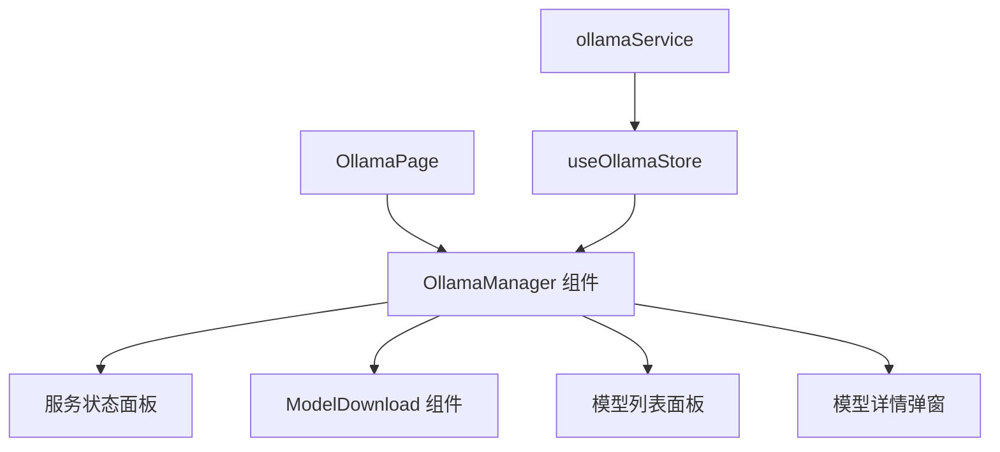
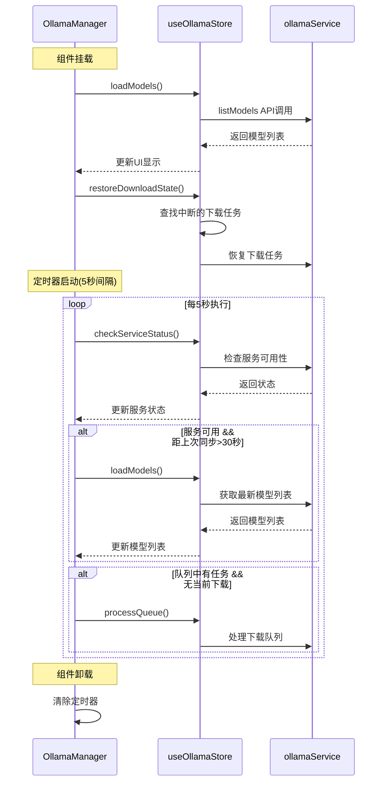
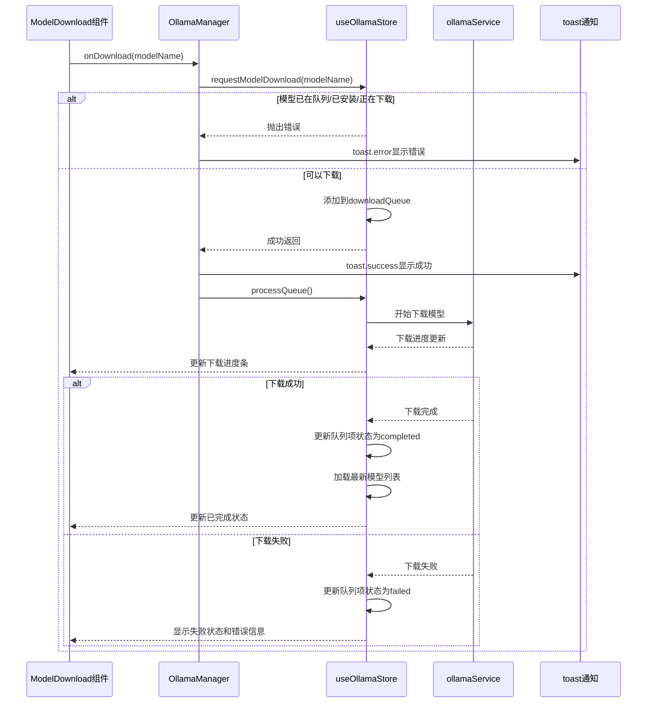
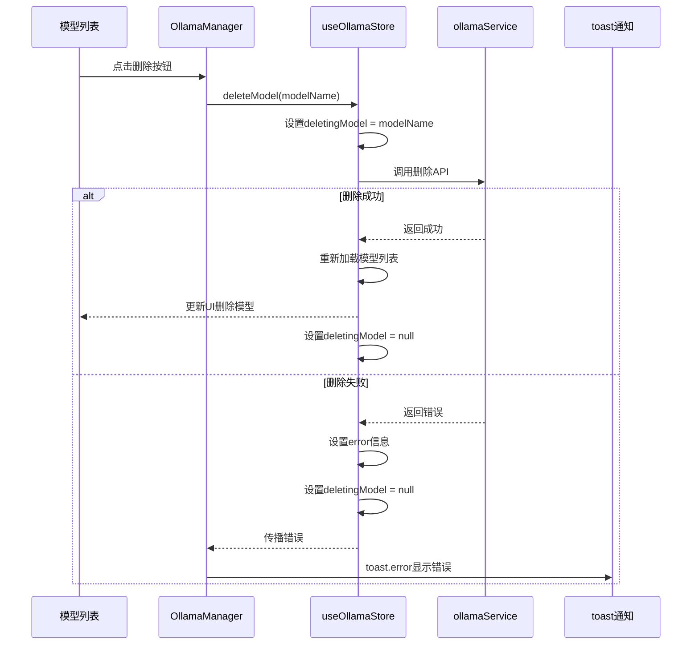
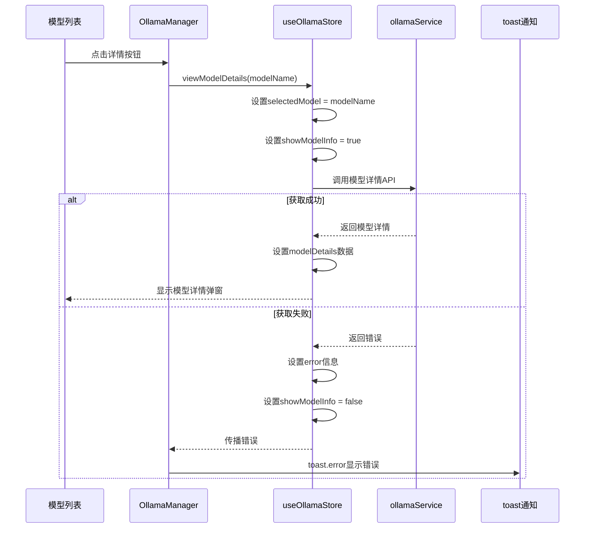
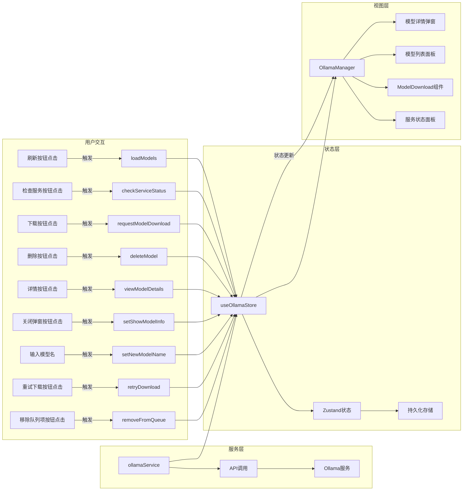
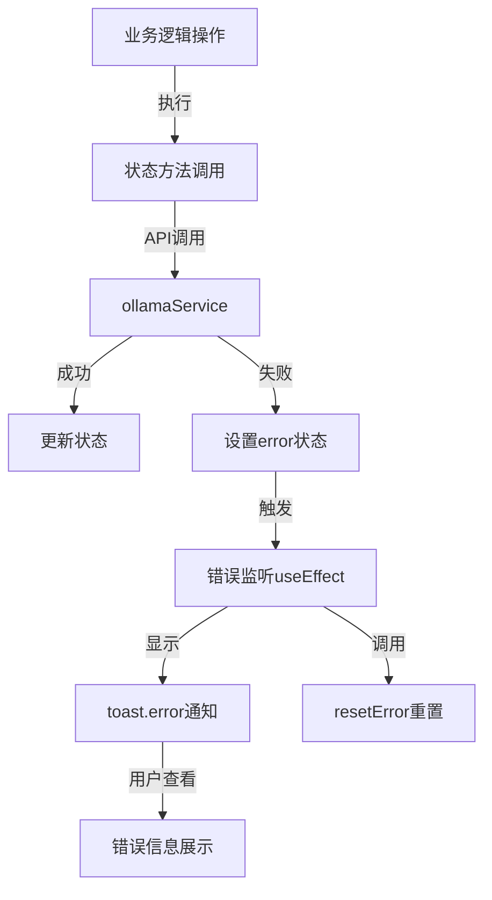

# Ollama 组件文档

本文档从事件驱动的角度详细分析 Ollama 组件的回调函数、副作用和状态管理的关系，帮助开发者理解组件的工作流程。

## 组件架构概览



## 事件驱动流程

### 组件初始化与自动检查



## 关键事件回调与处理流程

### 1. 模型下载流程



### 2. 模型删除流程



### 3. 查看模型详情流程



## 组件副作用 (useEffect) 分析

| 副作用     | 依赖项                           | 功能描述                                 | 触发条件        |
| ---------- | -------------------------------- | ---------------------------------------- | --------------- |
| 初始化加载 | [loadModels, checkServiceStatus] | 加载模型列表、恢复下载状态、启动定时检查 | 组件挂载时      |
| 错误监听   | [error, resetError]              | 监听错误状态变化并显示通知               | error状态变化时 |

### 初始化加载副作用详解

```javascript
useEffect(() => {
  // 首次加载模型列表
  loadModels().catch(err => {
    toast.error('加载模型列表失败', {
      description: err instanceof Error ? err.message : String(err),
    });
  });

  // 恢复下载状态
  const state = useOllamaStore.getState();
  state.restoreDownloadState().catch(err => {
    toast.error('恢复下载状态失败', {
      description: err instanceof Error ? err.message : String(err),
    });
  });

  // 定时任务设置
  const timer = setInterval(() => {
    // 检查服务状态
    checkServiceStatus().catch(err => {
      console.error('Ollama 服务状态检查失败:', err);
    });

    // 自动刷新模型列表
    const now = Date.now();
    const lastSync = state.lastSyncedModelsTime || 0;
    if (state.serviceAvailable && now - lastSync > 30000) {
      loadModels().catch(err => {
        console.error('自动刷新模型列表失败:', err);
      });
    }

    // 处理下载队列
    if (
      state.downloadQueue.some(
        item => item.status === 'pending' || item.status === 'downloading'
      ) &&
      !state.currentDownload
    ) {
      state.processQueue().catch(err => {
        console.error('处理下载队列失败:', err);
      });
    }
  }, 5000);

  // 清理函数
  return () => {
    clearInterval(timer);
    console.log('已停止 Ollama 服务状态检查');
  };
}, [loadModels, checkServiceStatus]);
```

### 错误监听副作用详解

```javascript
useEffect(() => {
  if (error) {
    // 跳过"已安装"错误，因为它会在 onDownload 函数中单独处理
    if (!error.includes('已安装')) {
      toast.error(error);
    }
    resetError(); // 显示后重置错误
  }
}, [error, resetError]);
```

## 组件属性与回调函数

### OllamaManager 从 Store 获取的状态

| 状态属性             | 类型                       | 描述             |
| -------------------- | -------------------------- | ---------------- |
| models               | OllamaModel[]              | 已安装的模型列表 |
| isLoading            | boolean                    | 加载状态标志     |
| serviceAvailable     | boolean                    | 服务可用状态     |
| newModelName         | string                     | 新模型名称输入   |
| error                | string \| null             | 错误信息         |
| version              | string \| null             | Ollama版本       |
| selectedModel        | string \| null             | 选中的模型       |
| modelDetails         | OllamaShowResponse \| null | 模型详情         |
| showModelInfo        | boolean                    | 模型详情显示状态 |
| deletingModel        | string \| null             | 正在删除的模型   |
| currentDownload      | CurrentDownload \| null    | 当前下载信息     |
| lastCheckedTime      | number \| null             | 服务检查时间     |
| lastSyncedModelsTime | number \| null             | 模型同步时间     |

### OllamaManager 从 Store 获取的方法

| 方法                 | 用途             | 调用场景                   |
| -------------------- | ---------------- | -------------------------- |
| loadModels           | 加载模型列表     | 初始化、手动刷新、定时刷新 |
| checkServiceStatus   | 检查服务状态     | 初始化、定时检查、手动检查 |
| downloadModel        | 下载模型         | 从队列处理时调用           |
| deleteModel          | 删除模型         | 用户点击删除按钮           |
| viewModelDetails     | 查看模型详情     | 用户点击详情按钮           |
| setShowModelInfo     | 设置模型详情显示 | 打开/关闭详情弹窗          |
| setNewModelName      | 设置新模型名称   | 用户输入模型名             |
| resetError           | 重置错误状态     | 错误显示后                 |
| requestModelDownload | 请求下载模型     | 用户点击下载按钮           |

### ModelDownload 组件接收的属性

| 属性               | 类型                                 | 描述             | 来源                             |
| ------------------ | ------------------------------------ | ---------------- | -------------------------------- |
| modelName          | string                               | 模型名称输入值   | newModelName状态                 |
| onModelNameChange  | (name: string) => void               | 名称输入变更回调 | setNewModelName                  |
| onDownload         | (modelName: string) => Promise<void> | 下载请求回调     | 异步函数包装requestModelDownload |
| onOpenModelLibrary | () => void                           | 打开模型库回调   | 跳转至Ollama官网                 |
| onRetryDownload    | (modelName: string) => Promise<void> | 重试下载回调     | 异步函数包装store.retryDownload  |
| onRetryAllFailed   | () => Promise<void>                  | 重试所有失败回调 | 异步函数包装store.retryAllFailed |
| onRemoveFromQueue  | (modelName: string) => void          | 从队列移除回调   | 包装store.removeFromQueue        |
| onCloseCompleted   | (modelName: string) => void          | 关闭完成项回调   | 包装store.removeFromQueue        |
| isServiceAvailable | boolean                              | 服务可用状态     | serviceAvailable状态             |
| isDownloading      | boolean                              | 是否正在下载     | 基于currentDownload判断          |
| downloadProgress   | DownloadProgress                     | 下载进度数据     | currentDownload?.progress        |
| downloadQueue      | QueueItem[]                          | 下载队列数据     | store.downloadQueue              |

## 状态-视图-动作流程图



## 错误处理流程



## 定时任务与自动处理

组件通过定时器实现以下自动处理机制：

1. **服务状态检查** - 每5秒检查一次Ollama服务状态
2. **模型列表自动刷新** - 当服务可用且距离上次同步超过30秒时自动刷新
3. **下载队列处理** - 定期检查并处理下载队列中的任务
4. **下载状态恢复** - 应用重启后自动恢复中断的下载任务

## 组件与模型层通信

1. **状态读取** - 组件通过useOllamaStore钩子获取状态
2. **事件触发** - 组件通过调用状态方法触发状态变更
3. **状态变化响应** - 状态变化自动触发组件重渲染
4. **异步状态处理** - 异步操作结果通过Promise处理

## 最佳实践与注意事项

1. **错误处理封装** - 所有API调用都有try-catch处理，并通过toast提供友好提示
2. **定时任务清理** - 组件卸载时清除定时器，防止内存泄漏
3. **状态持久化** - 下载队列等关键状态通过持久化存储，支持页面刷新后恢复
4. **进度实时更新** - 下载进度通过状态实时更新，提供良好的用户体验
5. **组件分离** - 将下载功能抽象为独立组件ModelDownload，提高代码复用性
